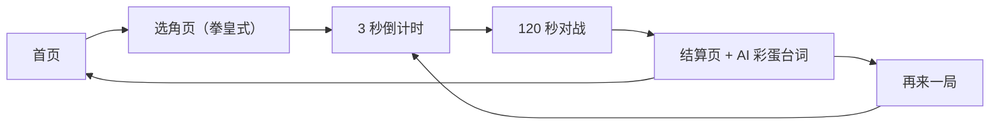
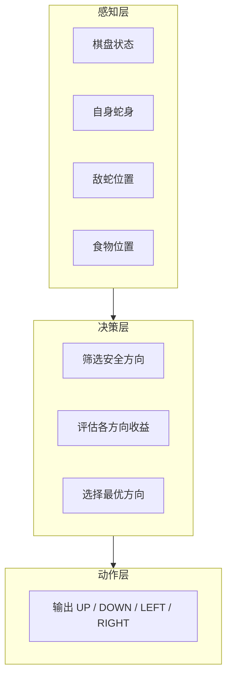
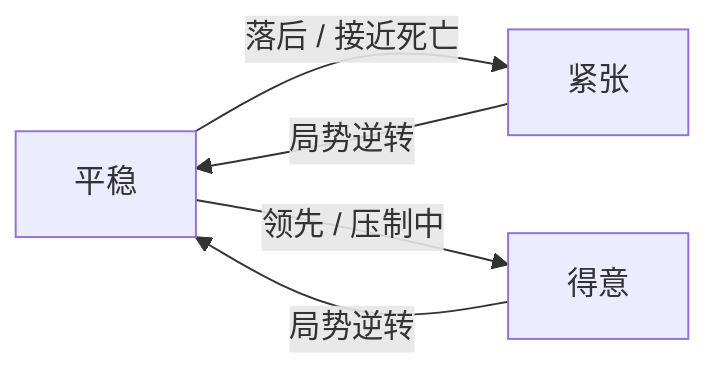
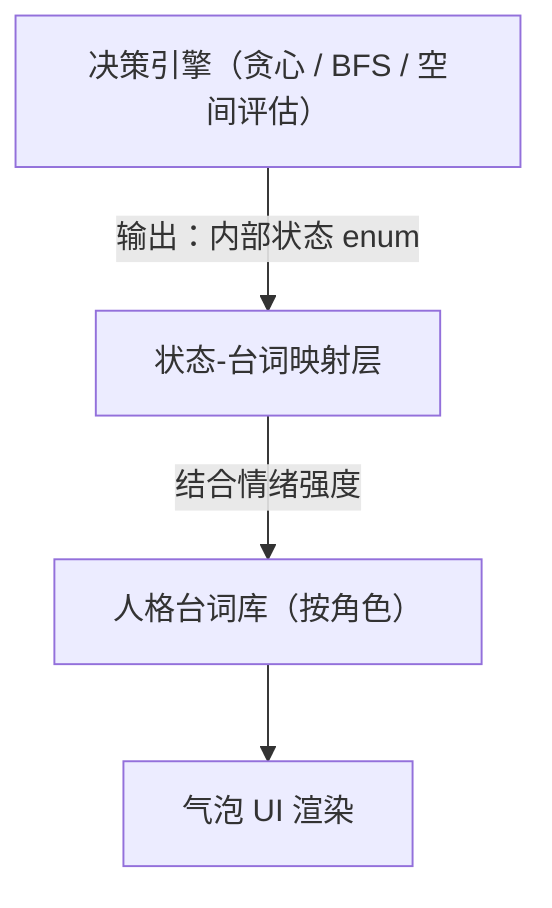

# CyberSnake（电子蛇战争）AI 产品设计文档

| 项目 | 内容 |
|------|------|
| 项目名称 | CyberSnake / 电子蛇战争 |
| 一句话定位 | 在限时竞速中，与会思考的 AI 蛇一决高下 |
| 文档版本 | v0.1 |
| 更新日期 | 2026-08-11 |
| 文档用途 | 求职作品集：AI 产品经理（游戏行业） |
| 交付物 | 可玩网站（Vercel 部署）+ 本设计文档 |

## 目录

1. [项目概述](#一项目概述)
2. [核心玩法规格](#二核心玩法规格)
3. [AI 产品设计](#三ai-产品设计)
4. [AI 人格与台词系统（核心亮点）](#四ai-人格与台词系统核心亮点)
5. [体验指标](#五体验指标)
6. [关键产品决策](#六关键产品决策)
7. [范围与 V2 规划](#七范围与-v2-规划)
8. [附录](#附录)

---

## 一、项目概述

### 1.1 背景

经典贪吃蛇是一个人人都会玩、但很快会玩腻的单机游戏——缺少对抗，也就缺少紧张感和重玩的理由。**CyberSnake** 在经典规则之上加入一个会思考、会说话的 AI 对手，把"一个人打发时间"变成"一场有来有回的对局"。

### 1.2 项目目标

这是一份 **AI 产品经理** 岗位的求职作品，目标是证明：

- 我能把"AI 能力"设计成玩家可感知、可产生情感连接的游戏体验，而不只是一段跑得动的代码；
- 我能写出清晰、可被研发直接执行的 AI 行为规格；
- 我能用数据指标和产品决策的语言去讨论"AI 好不好玩"，而不是只停留在感觉层面。

### 1.3 目标用户与场景

- **用户画像**：休闲玩家，单局 2 分钟以内，碎片时间打开就能玩一局；也包括面试官/HR，在几分钟内快速体验并理解产品设计思路。
- **核心场景**：通勤路上来一局；面试前打开链接演示自己的作品。

### 1.4 交付物

- 一个部署在 Vercel 上的可玩网站（首页、选角页、游戏页）；
- 本设计文档（可同步渲染在网站的 `/about` 页面）。

---

## 二、核心玩法规格

### 2.1 模式定义

CyberSnake 只有一个核心模式：**玩家 vs AI，限时竞速**。

| 项 | 规格 |
|----|------|
| 模式 | 玩家（手动操作） vs AI（自动决策） |
| 地图 | 20 × 20 网格 |
| 单局时长 | 120 秒 |
| 胜负判定 | 时间到，比较双方分数；若一方提前死亡，另一方立即获胜；双方同时死亡判平局 |
| 食物 | 场上同时存在 1 个，被吃后立即随机刷新；吃到 +1 分，蛇身 +1 节 |
| 移动速度 | 固定速度（建议 8–10 tick/秒），不随蛇身变长而加速，保证 AI 决策稳定、玩家体验一致 |
| 操作方式 | 键盘方向键 / WASD |

选择"限时竞速"而非"死斗到底"，是为了让每一局都在可预期的时间内结束，既保证游戏节奏，也让作品演示更适合几分钟内讲清楚（详见第六章决策 2）。

### 2.2 用户流程



### 2.3 页面清单

| 页面 | 内容 |
|------|------|
| `/` 首页 | 品牌展示、Slogan、开始按钮 |
| `/select` 选角页 | 三档 AI 人格卡：头像、称号、台词试听，拳皇式横向排列 |
| `/play` 游戏页 | 棋盘、AI 肖像面板（仅 AI 一侧）、台词气泡、计分与倒计时 |
| `/about` | 设计说明页，呈现本文档核心内容 |

### 2.4 边界规则

为避免开发时产生歧义，以下细节需明确约定：

- 蛇不能做 180° 反向移动（即不能直接掉头咬自己）；
- 场上同时只有 1 个食物，因此不存在"双方同时吃到同一食物"的情况；
- 若双方在同一 tick 内相撞或同时触发死亡条件，判定为平局；
- 时间到且双方分数相同，判定为平局。

---

## 三、AI 产品设计

### 3.1 设计原则

| 原则 | 说明 |
|------|------|
| 公平性 | AI 不读取玩家的按键输入，仅基于双方都"看得见"的棋盘公开状态做决策 |
| 可解释性 | 玩家可以通过 AI 的人格台词理解它"在想什么"，减少"AI 是不是在作弊"的负面猜疑 |
| 乐趣优先 | AI 的强弱服务于体验节奏，而非单纯追求"下得最好"；Medium 档的设计目标是让玩家胜率维持在 50% 左右 |
| 人格化 | 用"小贪 / 老谋 / 蛇王"三个有性格的角色，替代冷冰冰的 Easy / Medium / Hard |

### 3.2 三档 AI 人格定义

| 档位 | 名称 | 设计定位 | 核心行为 | 预期玩家胜率 |
|------|------|----------|----------|--------------|
| Easy | 小贪 | 新手陪练 | 贪心朝食物移动，不检查逃生路线；约 20% 概率随机选错方向 | ~75% |
| Medium | 老谋 | 标准对手 | 用 BFS 寻路找最近的安全食物，移动前会检查自己会不会把自己堵死 | ~50% |
| Hard | 蛇王 | 高阶挑战 | 在老谋的基础上增加空间评估，会主动占据关键通道、限制玩家路线 | ~30% |

### 3.3 AI 架构：感知 → 决策 → 动作



### 3.4 各档位决策逻辑

- **小贪**：在所有可前进方向中，选择距离食物曼哈顿距离最小的方向；若该方向不安全（会撞墙/撞自己/撞对方），则随机选一个方向；额外设定约 20% 概率直接忽略安全检查，制造"憨憨"感的失误。
- **老谋**：对每个安全方向用 BFS 估算通往食物的路径长度；再模拟"吃完食物后剩余可达空间"，若某方向会导致自身可达空间过小则放弃该方向；在剩余候选中选择综合得分最高的方向。
- **蛇王**：在老谋的寻路能力基础上叠加"空间控制分"——优先选择能占住玩家与食物之间关键通道的方向；当检测到玩家临近时，切换为"压制模式"，主动限制玩家的可移动空间，而不只是闷头吃食物。

### 3.5 可扩展角色名册架构（Roster）

三档 AI 并不是写死的三段 if-else，而是抽象为一套可扩展的角色数据结构：

```
AICharacter {
  id, name, tagline          // 例如：小贪 / 老谋 / 蛇王
  decisionStrategy           // 复用 greedy / bfs / advanced 三种决策器之一
  personaLines: Map<State, string[]>   // 台词库，按内部状态分组
  emotionCurve                // 情绪强度触发规则（详见第四章）
}
```

未来新增一名 AI 挑战者，只需要配置新的人设与台词、复用已有的决策策略（或组合调参），无需改动决策引擎本身的代码。这正是第四章"决策层与表达层解耦"架构的落地方式，也是 V2 阶段"新增更多可挑战 AI 角色"的基础。

### 3.6 行为矩阵

三档 AI 在关键场景下的行为差异，完整表格见 [附录 A](#附录-aai-行为矩阵)。

---

## 四、AI 人格与台词系统（核心亮点）

这是 CyberSnake 区别于普通贪吃蛇 Demo 的核心设计：AI 不再只是"会下棋的程序"，而是三个有鲜明性格、会主动表达自己的角色。玩家不仅在和一个对手比分数，也在和一个"有性格的对手"过招。

### 4.1 三档人设卡

| 档位 | 名称 | 人设定位 | 语言风格关键词 |
|------|------|----------|----------------|
| Easy | 小贪 | 呆萌新手，老实可爱，会如实说出自己的想法 | 拟声词多、语气助词多、坦白心声 |
| Medium | 老谋 | 冷静策略家，算计更多、策略性更强 | 短句、术语感、陈述式 |
| Hard | 蛇王 | 阴险狡诈，语气充满嘲讽 | 挑衅、居高临下、压迫感 |

### 4.2 呈现形式：单侧 AI 肖像面板 + 气泡台词

- 棋盘居中，AI 一侧固定一个人格肖像面板——只展示 AI，不为玩家设置对称的肖像位。玩家是"操作者"，AI 是"被观察、被感知性格的对手"，界面刻意聚焦在"AI 在想什么"这一核心体验上。
- AI 的台词以漫画气泡的形式出现在肖像面板旁，而不是跟随蛇头移动，避免遮挡棋盘、增加视觉噪音。
- 更新时机：AI 内部状态发生切换时触发新台词，而不是每个 tick 都刷新，避免刷屏式的信息轰炸。
- 气泡在触发后停留 2–3 秒淡出；若状态未变化，则保持空白，不重复播报。

### 4.3 台词状态映射表

每个「内部状态 × 人格」组合维护 **4–6 条候选台词**，触发该状态时随机抽取一条播放，并避免与上一条重复，从根本上避免"AI 说来说去都是那句话"的枯燥感。下表每格仅展示 2 条节选，完整台词池见 [附录 C](#附录-c完整台词库)。

| 内部状态 | 触发条件 | 小贪（节选） | 老谋（节选） | 蛇王（节选） |
|----------|----------|------|------|------|
| `hunting`（追踪食物） | 存在通往食物的安全路径 | "食物！是食物！我要冲过去啦～" / "呀，看到啦，冲鸭！" | "路径已计算，前进。" / "最优解，锁定目标。" | "这块地盘，是我的。" / "又送上门了？" |
| `escaping`（危险规避） | 当前方向会导致自堵或高风险 | "呜哇！这边好像很危险！" / "不行不行，得躲开！" | "此路不通，重新规划。" / "风险过高，切换方案。" | "慌了？意料之中。" / "急了吧，慢慢来。" |
| `blocking`（封锁路线） | 检测到可阻挡玩家（仅老谋/蛇王） | （无此状态） | "封锁你的退路，是最优解。" / "这条路，我先占了。" | "想跑？门都没有。" / "困住你，才有意思。" |
| `wandering`（随机探索） | 无明确目标 / 小贪失误 | "呃...我要往哪边走呀？" / "咦？食物去哪里了？" | （几乎不触发） | （几乎不触发） |
| `deadend`（无路可走） | 所有方向均不安全，被迫接受结果 | "啊啊啊我是不是要撞墙了……" / "对不起大家，我尽力了！" | "局势不利，重新评估。" / "无解局面，接受结果。" | "死路一条，谁的？" / "连我也算漏了这步……" |

### 4.4 情绪强度状态机

在固定人设之上，叠加一个随局势变化的"情绪值"，让台词风格随对局进程自然演变，而不是从头到尾一成不变：



| 人格 | 情绪轴 | 平稳态 | 紧张态 | 得意态 |
|------|--------|--------|--------|--------|
| 小贪 | 慌张度 | 正常呆萌台词 | 语气更慌、叠字更多（"啊啊啊啊"） | 少见，若意外领先则表现为惊喜语气 |
| 老谋 | 无明显情绪波动（人设即冷静） | 陈述式 | 陈述式，几乎不变 | 陈述式 |
| 蛇王 | 嘲讽值 | 平淡挑衅 | 几乎不表现紧张（人设需要） | 嘲讽升级，更加狂妄 |

**产品意图说明**：老谋"情绪几乎不随局势变化"是刻意的设计，而不是遗漏——用"无论局势如何都保持冷静"这一反差，反而强化了它"算无遗策"的人设。三个角色对"情绪状态机"给出三种不同的响应方式，本身也是一种角色差异化设计。

### 4.5 结算页 AI 彩蛋台词

结算结果（胜 / 负 / 平）与人格组合，触发专属收尾台词，让对局结束不只是一个冷冰冰的分数页。完整台词见附录 C，示例：

| 结局 | 小贪 | 老谋 | 蛇王 |
|------|------|------|------|
| AI 胜 | 诶？我...我赢了？！ | 一切，都在计算之中。 | 菜就是菜，别不服。 |
| AI 负 | 呜呜，我下次会加油的！ | 有趣，你打破了我的预测模型。 | ……算你运气好。 |
| 平局 | 我们、我们打平啦？ | 平局也是一种数据。 | 算你走运，没让我出全力。 |

### 4.6 选角页设计（拳皇式）

- 三个人格横向排列，每个人格展示头像、称号与一句台词（支持点击/悬停切换试听文案）；
- 玩家选定后进入 3 秒倒计时，直接开局；
- 该页面在架构上直接复用 3.5 节的 Roster 数据结构渲染——V2 新增角色时只需要新增一条数据，不需要改动页面逻辑。

### 4.7 架构说明：决策层与表达层解耦



这是本章最重要的产品与工程论点：**AI 变强或变弱，只需要调整决策引擎；AI 变得更有性格、更有趣，只需要调整台词库**，两者互不干扰。这个解耦不仅让后续独立迭代更安全，也让"策划/内容"与"算法"两类工作可以并行推进，互不阻塞。

---

## 五、体验指标

第一版 Demo 不接入真实数据埋点，但预先定义清楚的指标，是产品思维的体现，也是后续迭代的依据。

| 指标 | 定义 | 目标值 | 用途 |
|------|------|--------|------|
| 首局胜率 | 新玩家第一局获胜的比例 | > 70% | 验证 Easy 档"小贪"是否足够友好，能建立新玩家信心 |
| 平均对局时长 | 单局从开始到结束的实际时长 | 90–120 秒 | 验证限时竞速的节奏设计是否合理 |
| Medium 胜率 | 玩家选择"老谋"时的胜率 | 45–55% | 验证核心档位 AI 强度是否平衡 |
| 复玩率 | 结算页出现后 30 秒内再次开局的比例 | > 50% | 验证游戏乐趣与挫败感控制是否得当 |
| AI 公平感 | 玩家对"AI 是否在作弊"的主观感受（V2 问卷收集） | 负面反馈 < 10% | 验证人格台词系统对"AI 作弊感"的缓解效果 |
| 人格偏好分布 | 三档 AI 被选中的比例分布 | 无强烈偏差，避免某一档过冷或过热 | 验证三档人设本身的吸引力是否均衡 |

**调优思路（简述）**：

- 小贪当前的 20% 失误率可根据实测在 15%–30% 之间调整；
- 蛇王"压制模式"的触发距离阈值可调；
- 建议每档 AI 手动试玩 20 局，记录胜率表格作为调优依据。

---

## 六、关键产品决策

以下每条决策采用「背景 → 选项 → 决策 → 理由」的方式记录，便于在面试中复盘设计思路。

**1. 为什么用规则 AI，而不是机器学习？**
可解释、可调试、零训练成本，且贪吃蛇这类强规则、状态空间有限的游戏，规则 AI 足以做出有策略感的对手；机器学习在这里投入产出比不高。

**2. 为什么是限时竞速，而不是死斗到底？**
死斗到底容易出现双方互相躲避、迟迟不结束的"苟活"局面，节奏拖沓；限时竞速保证每局都在可预期时间内结束，既保证体验节奏，也更适合作品演示。

**3. 为什么不做 AI vs AI 观战模式？**
第一版聚焦"玩家 vs AI"这一核心体验，主动控制范围，避免功能铺得太开而每个功能都做得不够扎实。

**4. 为什么用"人格台词"而不是路径可视化？**
路径高亮这类可视化只服务"看得懂算法"的用户；台词能让所有玩家（包括完全不了解 AI 原理的人）都能感知到"AI 在想什么"，也更符合游戏本身的娱乐属性。

**5. 为什么三档用人格命名，并配独立语言风格？**
玩家实际感知到的是"行为 + 性格"的组合差异，而不是抽象的数值差异；人格化也让 Easy 档的失误显得"可爱"而不是"AI 很笨"，在降低新手挫败感的同时不破坏游戏的沉浸感。

**6. 为什么台词固定在 AI 肖像面板，而不是跟随蛇头、也不给玩家配肖像？**
跟随蛇头移动会遮挡棋盘、增加视觉噪音；只给 AI 配肖像是刻意的表达取舍——玩家是"操作者"，AI 是"被观察、被感知性格的对手"，界面应该聚焦在"AI 在想什么"这一核心体验上，而不是对称地展示双方。

**7. 为什么决策引擎与台词表达层要解耦？**
这样可以让"调整 AI 强度"和"调整 AI 性格"两件事独立迭代，互不引入回归风险；也让 V2 新增角色的成本主要集中在内容设计（人设、台词），而不需要重写底层决策逻辑。

---

## 七、范围与 V2 规划

### 7.1 V1 范围（Must Have）

- 限时竞速对战（120 秒，玩家 vs AI）
- 三档 AI 人格 + 台词系统（含情绪强度状态机）
- 拳皇式选角页 + 结算页 AI 彩蛋台词
- 首页 / 选角页 / 游戏页 / 设计文档页
- Vercel 部署

### 7.2 V1 不做（Won't Have）

- AI vs AI 观战模式
- 排行榜 / 账号系统
- 道具系统
- 难度自适应推荐
- 真实数据埋点
- AI 决策揭秘卡片（把算法转成人格化的机制解释文案）
- 蛇头像素表情

### 7.3 V2 候选

- 自适应难度：玩家连赢 N 局后，推荐挑战更高难度
- 新增更多可挑战 AI 角色（复用 3.5 节的 Roster 架构）
- AI 决策揭秘卡片：结算后展示"老谋比你早 3 步预测到转向"式的机制解释彩蛋，把可解释 AI 和角色叙事结合起来
- 蛇头像素表情随情绪状态切换
- 局后 AI 决策统计复盘（追食物次数、封锁次数、失误次数等）
- 移动端触屏适配（虚拟方向键 / 滑动操作）

---

## 附录

### 附录 A：AI 行为矩阵

| 场景 | 小贪（Easy） | 老谋（Medium） | 蛇王（Hard） |
|------|--------------|----------------|--------------|
| 食物可安全到达 | 直奔食物，不做风险评估 | 计算最短安全路径后前往 | 评估是否值得绕路占据更优位置，再决定路线 |
| 周围空间狭小（接近自堵风险） | 不检测，可能因此自撞 | 提前放弃该方向，转向更安全的空间 | 优先寻找同时能占据空间优势的路径 |
| 与玩家路线交叉 / 正面相遇 | 无特殊处理，按原逻辑继续 | 保持安全距离，避免正面冲突 | 主动逼近，利用体位优势尝试封路 |
| 玩家与自己争抢同一食物 | 继续直奔食物，不考虑对方 | 比较双方到达时间，若明显劣势则放弃 | 优先抢占，即使小概率冒险也倾向争夺 |
| 所有方向都不安全（必死局） | 随机选择一个方向，坦然接受结果 | 选择"存活时间最长"的方向 | 选择"临死前仍可能拖累/威胁玩家"的方向 |
| 局势明显领先 | 无特殊变化，偶尔表现出小小得意 | 无明显变化，维持稳健策略 | 切换嘲讽语气，行为上更倾向压制而非单纯得分 |
| 局势明显落后 | 情绪变慌张，但行为逻辑不变 | 无明显变化，继续按计算行事 | 几乎不表现紧张，维持一贯强势姿态 |

### 附录 B：棋盘坐标与数据结构约定

供后续开发对齐的基础约定：

- 坐标系：左上角为原点 `(0, 0)`，x 轴向右递增，y 轴向下递增；
- 蛇身表示：坐标数组 `[{x, y}, ...]`，其中 `index 0` 为蛇头；
- 每个 tick 的执行顺序：**玩家输入 → AI 决策 → 双蛇同时移动 → 碰撞判定 → 食物判定**；
- AI 内部状态枚举：`hunting` / `escaping` / `blocking` / `wandering` / `deadend`，对应第四章的台词映射表。

### 附录 C：完整台词库

台词库按「人格 → 状态」组织，每组维护 4–6 条候选，随机播放并避免连续重复。

#### 小贪（Easy）

**hunting（追踪食物，平稳态）**
1. 食物！是食物！我要冲过去啦～
2. 呀，看到啦，冲鸭！
3. 唔，那边亮亮的是能吃的吗？走过去看看！
4. 机会来啦，我可不能错过！
5. 追上它，追上它！

**escaping（危险规避，平稳态）**
1. 呜哇！这边好像很危险！
2. 不行不行，得躲开！
3. 哎呀，差点就撞上了……
4. 感觉不太妙，换个方向好了！

**escaping（紧张态，接近死亡时）**
1. 啊啊啊啊怎么办怎么办！
2. 呜呜呜救命，是不是要没了！
3. 我、我不想撞墙啊！！

**wandering（随机探索）**
1. 呃...我要往哪边走呀？
2. 咦？食物去哪里了？
3. 嗯……这边看起来也还好？
4. 随便走走，说不定会遇到好东西！

**deadend（无路可走）**
1. 啊啊啊我是不是要撞墙了……
2. 对不起大家，我尽力了！
3. 呜……这局我好像不行了。

**confident（得意态，罕见的领先时刻）**
1. 诶嘿，我今天是不是有点厉害？
2. 咦？我好像领先了！好开心！

**结算台词**
- AI 胜：诶？我...我赢了？！ / 哇！我居然赢啦，谢谢大家！
- AI 负：呜呜，我下次会加油的！ / 对不起，我又输啦……不过我会努力的！
- 平局：我们、我们打平啦？ / 平局也不错嘛，下次再分胜负！

#### 老谋（Medium）

**hunting（追踪食物）**
1. 路径已计算，前进。
2. 最优解，锁定目标。
3. 距离与风险，均在可接受范围。
4. 目标明确，执行。
5. 这一步，是当前局面的最优选择。

**escaping（危险规避）**
1. 此路不通，重新规划。
2. 风险过高，切换方案。
3. 该路径已被排除。
4. 调整路线，规避风险。

**blocking（封锁路线）**
1. 封锁你的退路，是最优解。
2. 这条路，我先占了。
3. 限制你的选择，是我的策略。
4. 空间，由我掌控。

**wandering（几乎不触发，兜底台词）**
1. 当前局面复杂，评估中。

**deadend（无路可走）**
1. 局势不利，重新评估。
2. 无解局面，接受结果。
3. 这一局，算漏了一步。

**结算台词**
- AI 胜：一切，都在计算之中。 / 结果，符合预期。
- AI 负：有趣，你打破了我的预测模型。 / 数据会更新，下一局见。
- 平局：平局也是一种数据。 / 势均力敌，值得记录。

#### 蛇王（Hard）

**hunting（追踪食物）**
1. 这块地盘，是我的。
2. 又送上门了？
3. 别急，这口迟早是我的。
4. 唾手可得的东西，不吃白不吃。
5. 看好了，这才是效率。

**escaping（危险规避，几乎不表现紧张）**
1. 慌了？意料之中。
2. 急了吧，慢慢来。
3. 小场面，不足挂齿。

**blocking（封锁路线）**
1. 想跑？门都没有。
2. 困住你，才有意思。
3. 这条路，从一开始就不是你的。
4. 看你还能撑多久。
5. 退无可退，感觉如何？

**deadend（无路可走，罕见）**
1. 死路一条，谁的？
2. 连我也算漏了这步……
3. ……有点意思。

**confident（得意态，嘲讽值升高时）**
1. 看着吧，结局早就注定了。
2. 就这？我还以为你能撑久一点。
3. 菜是原罪，认了吧。

**结算台词**
- AI 胜：菜就是菜，别不服。 / 毫无悬念，正如所料。
- AI 负：……算你运气好。 / 哼，下次可没这么容易了。
- 平局：算你走运，没让我出全力。 / 平局？算你识相。

### 附录 D：文档修订记录

| 版本 | 日期 | 变更 |
|------|------|------|
| v0.1 | 2026-08-11 | 初稿：完成核心玩法规格、三档 AI 设计、AI 人格台词系统、体验指标与关键产品决策 |
