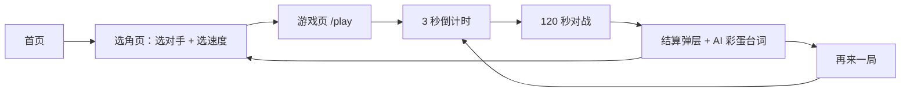
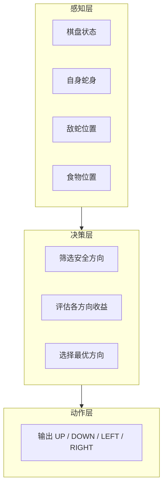
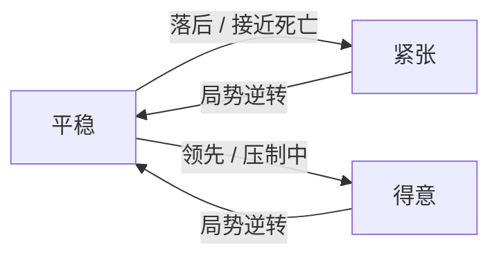
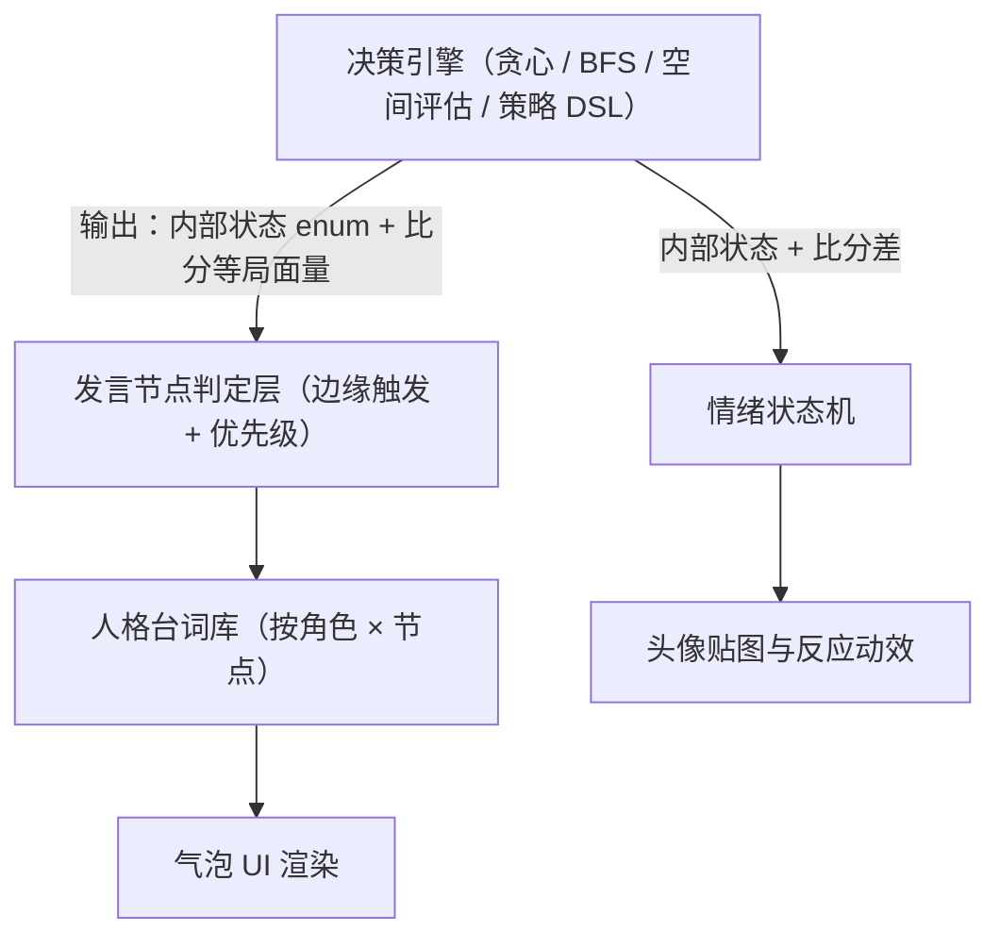
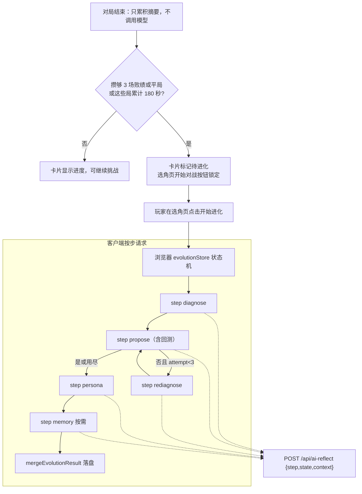

# CyberSnake（电子蛇战争）AI 产品设计文档

| 项目 | 内容 |
|------|------|
| 项目名称 | CyberSnake / 电子蛇战争 |
| 一句话定位 | 在限时竞速中，与会思考的 AI 蛇一决高下 |
| 文档版本 | v0.8 |
| 更新日期 | 2026-08-14 |
| 交付物 | 可玩网站（Vercel 部署）+ 本设计文档 |

## 目录

1. [项目概述](#一项目概述)
2. [核心玩法规格](#二核心玩法规格)
3. [AI 产品设计](#三ai-产品设计)
4. [AI 人格与台词系统（核心亮点）](#四ai-人格与台词系统核心亮点)
5. [自学习 AI 挑战者「？？？」（核心亮点）](#五自学习-ai-挑战者核心亮点)
6. [体验指标](#六体验指标)
7. [关键产品决策](#七关键产品决策)
8. [范围与 V2 规划](#八范围与-v2-规划)
9. [附录](#附录)

---

## 一、项目概述

### 1.1 背景

经典贪吃蛇是一个人人都会玩、但很快会玩腻的单机游戏——缺少对抗，也就缺少紧张感和重玩的理由。**CyberSnake** 在经典规则之上加入一个会思考、会说话的 AI 对手，把"一个人打发时间"变成"一场有来有回的对局"。

### 1.2 设计目标

- 把"AI 能力"设计成玩家可感知、可产生情感连接的游戏体验，而不只是一段跑得动的代码；
- 写出清晰、可被直接执行的 AI 行为规格；
- 用数据指标和产品决策的语言讨论"AI 好不好玩"，而不停留在感觉层面。

### 1.3 目标用户与场景

- **用户画像**：休闲玩家，单局 2 分钟以内，碎片时间打开就能玩一局。
- **核心场景**：通勤路上来一局；想看看"会自己变强的 AI"长什么样。

### 1.4 交付物

- 一个部署在 Vercel 上的可玩网站（首页、选角页、游戏页、设计说明页）；
- 本设计文档（`/about` 页面直接渲染其全文）。

---

## 二、核心玩法规格

### 2.1 模式定义

CyberSnake 只有一个核心模式：**玩家 vs AI，限时竞速**。

| 项 | 规格 |
|----|------|
| 模式 | 玩家（手动操作） vs AI（自动决策） |
| 地图 | 20 × 20 网格 |
| 单局时长 | 120 秒 |
| 胜负判定 | 时间到，比较双方分数；若一方提前死亡，另一方立即获胜；双方同时死亡判平局 |
| 食物 | 场上同时存在 1 个，被吃后立即随机刷新；吃到 +1 分，蛇身 +1 节 |
| 初始蛇长 | 双方各 3 节 |
| 移动速度 | 选角页三档可调：慢速 240 ms / 标准 180 ms / 快速 120 ms 每 tick（约 4.2 / 5.6 / 8.3 tick 每秒），不随蛇身变长而加速，保证 AI 决策稳定、玩家体验一致 |
| 操作方式 | 键盘方向键 / WASD；`Esc` 暂停与继续 |

选择"限时竞速"而非"死斗到底"，是为了让每一局都在可预期的时间内结束（详见第七章决策 2）。

### 2.2 用户流程



倒计时与结算都发生在游戏页内部：倒计时是覆盖在棋盘上的一层遮罩，结算是一个弹层，没有独立的结算页路由。

### 2.3 页面清单

| 页面 | 内容 |
|------|------|
| `/` 首页 | 品牌展示、Slogan、开始按钮、设计文档入口 |
| `/select` 选角页 | 四张角色卡（三档人格 + 自学习挑战者「？？？」）、速度档位分段控件、进化实验室、返回标题页 |
| `/play` 游戏页 | 棋盘、AI 肖像面板（仅 AI 一侧）、台词气泡、计分与倒计时、暂停弹层、结算弹层；触屏设备另有虚拟十字方向键 |
| `/about` | 设计说明页，直接渲染本文档全文 |

### 2.4 边界规则

为避免开发时产生歧义，以下细节需明确约定：

- 蛇不能做 180° 反向移动（即不能直接掉头咬自己）；
- 场上同时只有 1 个食物，因此不存在"双方同时吃到同一食物"的情况；
- 双方在同一 tick 内互换头部位置（迎面对撞）同样判定为相撞；
- 若双方在同一 tick 内相撞或同时触发死亡条件，判定为平局；
- 时间到且双方分数相同，判定为平局；
- 首帧食物固定在中心格（保证服务端渲染与客户端一致），进入对局后再随机重掷。

---

## 三、AI 产品设计

### 3.1 设计原则

| 原则 | 说明 |
|------|------|
| 公平性 | AI 不读取玩家的按键输入，仅基于双方都"看得见"的棋盘公开状态做决策 |
| 可解释性 | 玩家可以通过 AI 的人格台词理解它"在想什么"，减少"AI 是不是在作弊"的负面猜疑 |
| 乐趣优先 | AI 的强弱服务于体验节奏，而非单纯追求"下得最好"；Medium 档的设计目标是让玩家胜率维持在 50% 左右 |
| 人格化 | 用"小贪 / 老谋 / 蛇王"三个有性格的角色，替代冷冰冰的 Easy / Medium / Hard |

### 3.2 三档 AI 人格定义

| 档位 | 名称 | 设计定位 | 核心行为 | 预期玩家胜率 |
|------|------|----------|----------|--------------|
| Easy | 小贪 | 新手陪练 | 只看一步：在安全方向里挑离食物最近的，不做任何前瞻；每步有 20% 概率完全随机走 | ~75% |
| Medium | 老谋 | 标准对手 | 用 BFS 寻路走向食物，落子前先检查这一步之后自己还剩多少可达空间 | ~50% |
| Hard | 蛇王 | 高阶挑战 | 以老谋为下限，额外评估"挡住玩家取食路线"的收益，代价可控时切换压制模式 | ~30% |

选角页上这三档还各自带一条难度提示条（`challengeLevel`，0-100）与预期玩家胜率，让玩家在选之前就能感知强度差异。

### 3.3 AI 架构：感知 → 决策 → 动作



### 3.4 各档位决策逻辑

- **小贪**：先筛出这一步不会撞墙、撞自己、撞对方的方向，在其中选离食物曼哈顿距离最近的一个。每步有 20% 概率跳过这套逻辑、在全部可前进方向里随便挑一个（内部状态记为 `wandering`），这就是它"憨憨"感的全部来源。它不做任何前瞻，所以经常把自己走进死角。
- **老谋**：同样先筛安全方向，再用 BFS 计算"走这一步之后的可达空间"，只保留可达空间 ≥ 自身长度 + 2 的方向；然后用 BFS 求通往食物的第一步，如果这一步落在候选里就走它，否则退而求其次选可达空间最大的方向（内部状态 `escaping`）。它检查的是自己会不会被困死，不会去比较"谁先抢到食物"。
- **蛇王**：默认与老谋完全一致，保证下限不低于老谋。只有当玩家离食物 ≤5 步、且自己离玩家也够近时，才会评估压制：在"绕路不超过 2 步"的候选里，找一个能把玩家到食物的 BFS 路径拉得最长的方向；只有它确实比默认走法更能拖慢玩家，才真的切换到压制模式（内部状态 `blocking`）。它没有"领先就更凶"这种分支，压制与否只取决于位置关系。

### 3.5 可扩展角色名册架构（Roster）

三档 AI 并不是写死的三段 if-else，而是抽象为一套可扩展的角色数据结构（`src/game/ai/roster.ts`）：

```
AICharacter {
  id, name, title, tagline, description   // 例如：小贪 / 呆萌新手 / 食物！是食物！
  themeColorVar, themeColorVarSecondary   // 主题色，对应 globals.css 里的 CSS 变量
  avatarSrc                                // 像素头像
  decisionStrategy                         // 复用 greedy / bfs / advanced 三种决策器之一
  challengeLevel, expectedPlayerWinRate    // 选角页的强度提示条与预期胜率
}
```

角色数据、台词库、情绪规则是三份独立的资产：`roster.ts` 只描述"这个角色是谁、用哪个决策器"，台词在 `persona/lines.ts` 里按角色与发言节点分组，情绪规则在 `persona/emotion.ts`。三者用角色 id 关联，改任何一份都不会牵动另外两份。

未来新增一名 AI 挑战者，只需要追加一条角色记录、补一组台词、复用已有的决策策略（或组合调参），无需改动决策引擎本身的代码。这正是第四章"决策层与表达层解耦"架构的落地方式，也是 V2 阶段"新增更多可挑战 AI 角色"的基础。

这套架构随后被第四位挑战者「？？？」验证过一次：它的 `decisionStrategy` 是一个读取"当前策略规格"的闭包，`name`/`tagline`/台词全部改为从成长存档动态读取——**在不改动决策引擎、不改动棋盘与 HUD 渲染的前提下，接入了一个行为和人格都会随时间改变的角色**（详见第五章）。

### 3.6 行为矩阵

三档 AI 在关键场景下的行为差异，完整表格见 [附录 A](#附录-aai-行为矩阵)。

---

## 四、AI 人格与台词系统（核心亮点）

这是 CyberSnake 区别于普通贪吃蛇 Demo 的核心设计：AI 不再只是"会下棋的程序"，而是三个有鲜明性格、会主动表达自己的角色。玩家不仅在和一个对手比分数，也在和一个"有性格的对手"过招。

### 4.1 三档人设卡

| 档位 | 名称 | 称号 | 人设定位 | 语言风格关键词 |
|------|------|------|----------|----------------|
| Easy | 小贪 | 呆萌新手 | 老实可爱，会如实说出自己的想法 | 拟声词多、语气助词多、坦白心声 |
| Medium | 老谋 | 冷静策略家 | 算计更多、策略性更强 | 短句、术语感、陈述式 |
| Hard | 蛇王 | 阴险嘲讽 | 阴险狡诈，语气充满压迫 | 挑衅、居高临下、压迫感 |

第四位挑战者「？？？」不在此表内：它没有预设人设，名字与语言风格都由大模型在成长过程中自己写出来，详见[第五章](#五自学习-ai-挑战者核心亮点)。

### 4.2 呈现形式：单侧 AI 肖像面板 + 气泡台词

- 棋盘居中，AI 一侧固定一个人格肖像面板——只展示 AI，不为玩家设置对称的肖像位。玩家是"操作者"，AI 是"被观察、被感知性格的对手"，界面刻意聚焦在"AI 在想什么"这一核心体验上。桌面（`md` 及以上）保持棋盘 22px 格子 + 180px 立绘；窄屏或矮视口把棋盘按整数格子缩小，立绘收到底栏，避免横向溢出。
- 触屏设备提供虚拟十字方向键（上/下/左/右），写入与键盘相同的方向队列；不提供滑动手势，避免和点按抢输入。鼠标桌面不出现虚拟键。
- AI 的台词以漫画气泡的形式出现在肖像面板旁，而不是跟随蛇头移动，避免遮挡棋盘、增加视觉噪音。气泡停留 3.2 秒（最后 300 毫秒淡出），淡出后不补新词。
- **沉默是常态，开口是事件。** 没有"内部状态兜底闲聊"这一档：AI 只在 4.3 节列出的**发言节点**刚发生的那一刻开口一次，其余时间保持沉默。`hunting`、普通 `escaping`、`wandering` 这类几乎全程成立的日常状态永远不触发台词——沉默的时间越长，真正开口时才越有分量。
- 所有发言节点都是**边缘触发**：只在条件刚从"否"变成"是"的那一刻命中一次，即使条件持续成立（比如一直卡在同一处），也不会重复播报同一件事。多个节点在同一 tick 同时命中时，按 4.3 节的优先级只播报最高优先级的一个，其余作废（不排队播完，避免"追着补课"的割裂感）。
- 最短开口间隔 `MIN_SPEECH_HOLD_MS`（2.4 秒）只承担防抖职责：避免"卡住时长刚好在阈值附近来回跳"这类边界抖动把同一件事判成两次独立事件。节点命中时若正处在防抖窗口内，会先记下优先级最高的那个，窗口一结束立刻补播，不会被吞掉。

### 4.3 发言节点清单（唯一的台词触发来源）

没有"内部状态兜底台词池"。下表是 AI 会开口的**全部**情形，按优先级从高到低排列；未列出的日常状态（`hunting`、普通 `escaping`、`wandering` 等）永远保持沉默。更多台词示例见 [附录 C](#附录-c台词库结构与示例)。

| 优先级 | 节点 | 判定条件（均为边缘触发） | 小贪（节选） | 老谋（节选） | 蛇王（节选） |
|---|------|----------|------|------|------|
| 1 | `gameStart` | 开局第一个 tick | 复用选角页已展示的签名台词（`AICharacter.tagline`），不重复维护内容 | 同上 | 同上 |
| 2 | `streakBig` | 连续吃到 8 个以上豆子（中途未被玩家吃到打断） | "哇啊！我是不是要起飞了！！" | "连续收益超出基准值，继续保持。" | "还要我继续表演吗？" |
| 3 | `streak` | 连续吃到 3 或 5 个豆子 | "哇！我连续吃到好几个了！" | "效率符合预期。" | "看到了吗，这就是实力。" |
| 4 | `deadend` | `aiInternalState` 刚从其他状态变为 `deadend`（被逼到死路） | "啊啊啊我是不是要撞墙了……" | "局势不利，重新评估。" | "死路一条，谁的？" |
| 5 | `blocking` | `aiInternalState` 刚变为 `blocking`：老谋在近距离与玩家争同一颗食物，或蛇王真的切换到压制模式。只有这两档会出现 | （无此状态） | "封锁你的退路，是最优解。" | "想跑？门都没有。" |
| 6 | `blocked` | 卡住（`escaping`/`wandering`/`deadend`）累计真实时长刚跨过 1.4 秒阈值 | "呜……这条路怎么走不过去呀！" | "此路径已被验证不可行，重新评估。" | "……有点烦人。" |
| 7 | `bigLead` | 比分差（AI − 玩家）刚从 <3 变为 ≥3 | "诶嘿嘿，是不是已经赢定了！" | "优势已经建立，维持节奏即可。" | "已经没什么好悬念的了。" |
| 8 | `bigDeficit` | 比分差（AI − 玩家）刚从 >−3 变为 ≤−3 | "呜哇，差距怎么这么大……" | "这个结果，超出了我的预测模型。" | "哼，这才刚开始。" |

设计取舍说明：`bigLead`/`bigDeficit` 只在"刚跨过阈值"那一刻播报一次，之后即使领先/落后幅度继续扩大也不会重复炫耀或抱怨——这是刻意的，避免"同一件事说两遍"削弱台词的分量；如果比分差回落到阈值内再重新跨过，则会被视为一次新的事件，重新播报。

### 4.4 情绪强度状态机

在固定人设之上，叠加一个随局势变化的"情绪值"，让台词风格随对局进程自然演变，而不是从头到尾一成不变：



| 人格 | 情绪轴 | 进入紧张态 | 进入得意态 | 头像反应动效 |
|------|--------|------------|------------|--------------|
| 小贪 | 慌张度 | 落后 ≥2 分，或被逼到死路 | 领先 ≥2 分 | 紧张时抖动，其余情况都是弹跳 |
| 老谋 | 恒定冷静（人设即无波动） | 不进入 | 不进入 | 始终是点头 |
| 蛇王 | 嘲讽值 | 不进入 | 领先 ≥2 分，或正在封锁玩家 | 得意时歪头，其余是摇摆 |
| ？？？ | 沿用小贪那套阈值 | 落后 ≥2 分，或被逼到死路 | 领先 ≥2 分 | 始终是信号故障式的抖动 |

`calm` 不叠加情绪贴图，只有 `tense` / `confident` 才会在头像上出现一张情绪贴图——避免贴图常驻分散注意力。

**产品意图说明**：老谋"情绪不随局势变化"是刻意的设计，而不是遗漏——用"无论局势如何都保持冷静"这一反差，反而强化了它"算无遗策"的人设。「？？？」不写死情绪规则，是因为它的性格应该由进化出来的台词体现，而不是一套预设曲线。

**与 4.3 节发言节点的关系**：情绪状态机只驱动头像的情绪贴图与反应动效（阈值较低，比分差 ≥2），不驱动任何台词文本；4.3 节的 `bigLead`/`bigDeficit` 才是驱动台词内容的唯一信号（阈值更高，比分差 ≥3）。二者是两套独立但互补的信号——领先 2 分时头像先流露出小动作，领先 3 分以上台词才明确开口"炫耀"，形成"表情先动、台词后到"的层次感，也避免了情绪这个连续量被当成台词触发条件而导致频繁开口。

### 4.5 结算页 AI 彩蛋台词

结算结果（胜 / 负 / 平）与人格组合，触发专属收尾台词，让对局结束不只是一个冷冰冰的分数页：

| 结局 | 小贪 | 老谋 | 蛇王 |
|------|------|------|------|
| AI 胜 | 诶？我...我赢了？！ | 一切，都在计算之中。 | 菜就是菜，别不服。 |
| AI 负 | 呜呜，我下次会加油的！ | 有趣，你打破了我的预测模型。 | ……算你运气好。 |
| 平局 | 我们、我们打平啦？ | 平局也是一种数据。 | 算你走运，没让我出全力。 |

### 4.6 选角页设计（拳皇式）

- 四张角色卡横向排列（三档人格 + 自学习挑战者「？？？」），每张卡展示头像、名字、一句签名台词、一句角色简介与强度提示条；
- 台词固定展示这一句、不做悬停试听——选角页要在两三秒内传达"这是谁"，多一层交互反而稀释了第一印象；
- 卡片下方是速度档位分段控件，左上角是返回标题页入口；选定角色后跳转游戏页，倒计时在那里播放；
- 该页面直接复用 3.5 节的 Roster 数据结构渲染——V2 新增角色时只需要新增一条数据，不需要改动页面逻辑。

### 4.7 架构说明：决策层与表达层解耦



这是本章最重要的产品与工程论点：**AI 变强或变弱，只需要调整决策引擎；AI 变得更有性格、更有趣，只需要调整台词库**，两者互不干扰。这个解耦不仅让后续独立迭代更安全，也让"策划/内容"与"算法"两类工作可以并行推进，互不阻塞。

---

## 五、自学习 AI 挑战者「？？？」（核心亮点）

前三档 AI 是**手工设计的人格化启发式**：强弱与性格都由我预先写死，玩家玩一百局，第一百局的小贪和第一局的小贪没有任何区别。第四位挑战者要回答的是另一个问题——**如果让大模型来当这条蛇的"教练"，它能不能在几局之内把自己从一个纯新手练成一个像样的对手？**

这一章的核心不是"接了个大模型 API"，而是**如何让不可靠的大模型输出，安全地驱动一个确定性的实时系统**。

### 5.1 产品设定

| 项目 | 内容 |
|------|------|
| 内部 id | `mystery`（仅代码使用，不展示给玩家） |
| 初始展示名 | `？？？`（名字本身也是可变的，大模型有权在成长中给自己改名） |
| 初始状态 | 纯新手：不看路、50% 概率随机乱走、只会朝食物直冲，经常开局就撞墙 |
| 初始台词 | 只有「……」这类噪声——**它一开始连话都不会说** |
| 强度上限 | 无人为封顶。它能变多强，完全取决于大模型的提案能不能通过回测 |
| 成长存档 | 保存在玩家浏览器的 `localStorage`，支持导出/导入 JSON |

"名字、台词、强度全都是空白，由它自己填上"——这是这个角色的叙事内核。玩家第一次看到选角页第四张卡片时，那里只有一个问号和"尚未觉醒"；十局之后，它可能已经给自己起好了名字，并开始用完整的句子嘲讽你。

### 5.2 为什么不在对局中实时调用大模型

这是本章第一个关键决策。贪吃蛇每 120–240 毫秒就要推进一个 tick，而一次大模型调用的延迟在秒级——**实时调用在物理上就不成立**，强行接入只会得到一个卡顿、抽搐、无法回放的对手。

所以这里采用**"离线调参、在线执行"**的分工：

- **在线**：对局中的每一步决策，都由本地一个纯函数 `decideStrategy()` 完成，零网络请求、零延迟、完全确定性；
- **离线**：攒够几局之后，才把复盘数据交给大模型，让它去改那个纯函数读取的**策略规格**。

大模型改变的是"这条蛇的性格与本能"，而不是"这条蛇的每一步"。这样既拿到了大模型的泛化能力，又保住了游戏必须的实时性与可复现性。

### 5.3 策略 DSL：让模型改算法，而不只是拧旋钮

第一版用 6 个标量参数（"策略基因"）驱动决策。实测发现：第一轮把安全检查、前瞻、失误率调好之后，能力约等于老谋；剩下三个旋钮对胜负影响很小且互相抵消，模型无论怎么调都找不到增益，进化会连续被否决。

因此改成一份**可组合的策略规格**（`src/game/ai/strategy/`）。大模型仍然不能写可执行代码，但可以换主寻路算法、重排规则、调特征权重、写一段受限打分表达式：

| 字段 | 含义 | 边界 |
|------|------|------|
| `pathMode` | 主寻路：贪心直冲 / BFS 最短路 / BFS 最安全 / 空间填充 / 追尾巴 | 五选一 |
| `weights` | 九个特征的打分权重：离食物近、可达空间、能回到尾巴、通道宽度、封锁对手、与对手距离、离墙距离、抢食领先、保持原方向 | 每项 -2 ~ 2 |
| `scoreExpression` | 可选。只用特征名、数字、`+ - * / ( )` 与 `min/max/clamp/abs` 的打分公式；合法时优先于权重 | ≤160 字符、语法树 ≤40 节点，**不用 eval** |
| `rules` | 有序规则表，先匹配先生效。条件八选一：始终 / 可达空间低于 N / 自身长度超过 N / 对手比自己离食物近 N 步 / 落后超过 N 分 / 领先超过 N 分 / 剩余时间不足 N 秒 / 对手头部在 N 格内；动作六选一：追食物 / 先求生 / 追尾巴 / 封锁对手 / 退向空地 / 贴边走 | 最多 5 条，阈值 0~120 |
| `safety` | 避死、逃生空间、尾巴安全三个开关，加一个空间余量 | 余量 0~6 |
| `mistakeProbability` | 每步随机乱走的概率 | 0 ~ 0.5 |
| `notes` | 写给下一轮自己看的备注 | ≤120 字 |

几个关键约束：

1. **特征惰计算**。只计算权重非 0 或被表达式引用的特征，否则 4 候选 × 多次 BFS × 667 tick 会让回测慢一个数量级。
2. **表达式是数据不是代码**。手写递归下降解析器，非法公式整段丢弃并回落到权重；导入他人存档没有代码执行风险。
3. **主寻路方向有 +0.15 的打分偏置**。否则权重全为 0 时打分完全打平，蛇会退化成随机走——寻路模式必须始终是那个兜底的默认答案。
4. **新手默认值就是"什么都不会"**：贪心直冲、关闭全部安全模块、失误率 0.5。成长路径覆盖"从垫底爬到能打三种风格的对手"。
5. 旧版存档里的标量基因会在读取时映射成一份规格，并把旧适应度清空后重测——执行器换了，数字不可比。

### 5.4 对战记录：用可重放的最小信息还原完整对局

大模型要复盘，就得先有"局"可复。但逐帧存储双方完整蛇身坐标非常冗余（120 秒约 667 个 tick，每 tick 两条几十节的蛇）。

这里用的方案是**只记录能完整重放的最小信息**（`src/game/replay.ts`）：每个 tick 记下双方实际移动方向、AI 内部状态，以及"本 tick 是否刷新了食物、刷到哪"。把这些输入回放进纯函数 `stepGame()`，就能确定性地还原出每一 tick 的完整坐标——**存储量小一个数量级，信息量完全无损**。

然后由 `deriveMatchSummary()` 把回放提炼成结构化摘要：胜负与双方比分、存活时长、死因、连吃峰值、无路可走帧数、内部状态占比、离食物平均距离、转向频率、比分曲线，再加上能区分「被围死 / 自己走进死角」的死亡现场（`avoidableDeath` / `deathContext`）、抢食记录（`foodContests`，只留最近 8 次）、平均可达空间占比、浪费转向次数。**发给大模型的是这份摘要，不是原始坐标流**，进 Prompt 前还会再压一道（抢食记录只带最近 6 次）。

### 5.5 进化的触发时机：攒够数据，再由玩家发起

第一版是"每局结束自动复盘一次，用 60 秒硬冷却防刷"。实际玩下来有三个问题：**单局的数据量根本不够看**（新手蛇经常七八秒就撞死，一局只能得出"它又撞墙了"这一条结论）；**每局都调用太费**；而且冷却是一个凭空拍出来的数字，跟模型到底想了多久毫无关系。

改成**攒够素材、由玩家在选角页手动发起**：

| 项 | 规则 |
|------|------|
| 触发条件 | 自上次进化以来累计 **3 场败绩或平局**，或这些局累计时长 ≥ **180 秒**。它赢了的对局不计入 |
| 触发方式 | 结算弹层只做提示（输掉时显示「它记下了这一局 · 已积累 2/3」，赢了时说明本局不计入），真正的按钮在选角页的进化实验室 |
| 门禁 | 素材攒够但还没进化时，选角页的**「开始对战」对它禁用**——先让它复盘完，再继续挑战。它连胜时不锁战 |
| 并发控制 | 进化进行中禁止开战：那时它的策略正在被改写，打了也不算数。这一条在选角页与游戏页都会拦 |
| 复盘输入 | 进化时把**全部待复盘局**的摘要一起交给诊断，通常是 3 局；走 180 秒那条线时也可能只有 1~2 局 |
| 成本护栏 | 用"必须先暴露问题"替代固定冷却：现役策略一直赢就不必花钱复盘 |

进化实验室顶部的进度条按局数显示（`2/3`），180 秒是一条不在进度条上体现的旁路——一局打得够久，本身就说明有足够的行为数据可读。

这条门禁同时解决了叙事问题：玩家不再是"打完一局，弹窗里闪过一行看不懂的日志"，而是**攒够素材 → 亲手按下进化 → 看着它一步步想 → 再上场验证**。成长第一次变成了玩家参与的循环，而不是背景里的自动任务。

### 5.6 Agent 技能层：把"调一次 API"拆成一条有护栏的流水线

「？？？」被设计成一个**有固定技能清单的 Agent**，而不是一次性的黑箱调用。拆开的理由很实在：同一次调用里既让模型分析又让它改参数，它往往是先想好要改什么、再倒推理由；而且整个过程只有一个 loading 圈，玩家完全看不出它在干嘛。

| # | 技能 | 输入 | 输出 | 用大模型 | 时间预算 |
|---|------|------|------|----------|----------|
| 1 | **诊断** | 本轮全部待复盘局的摘要 + 现役规格 + 策略手册 + 历史采纳/否决 | 最多 4 条问题：现象 / 证据 / 根因 / 假设 / 预期效果 | 是 | 50s |
| 2 | **进化** | 诊断结论 + 策略手册 + （重试时）未通过原因、回测复盘与被否决的改动 | 完整 `StrategySpec` + 逐项归因 | 是 | 50s |
| 3 | **进化测试** | 候选规格 + 现役规格（与提案同请求） | 是否通过 + 拒因 + 结构化复盘（适应度分项、按对手归因、最差局） | 否 | 12s |
| 4 | **人格** | 真正生效的变化 + **由现役规格算出的打法侧写** + 人格档案 + 现有台词 + 目标代数 | 增量台词 + 人格档案微调 + 改名与自述 | 是 | 45s |
| 5 | **记忆整理** | 历史对局 + 进化日志 + 旧笔记 | 一份 ≤200 字的长期经验笔记 | 是 | 40s |

几个关键的设计取舍：

- **诊断与提案分离**（技能 1 / 2）。强制它先只输出"病症、根因与假设"，下一步的每一处改动都必须引用某条病症。
- **自我修正循环**（技能 3 → 1 → 2）。回测不通过时不是把一句「适应度下降了」扔回提案模块碰运气：先用回测留下的每局复盘算出一份结构化对比（适应度五项各掉了多少、三种对手谁在拖后腿、退化最狠的 2~3 局），再走一次诊断（请求契约上叫 `rediagnose`，UI 仍落在「诊断」那一行），产出「未通过原因」和一份**替换掉旧清单**的新问题清单，然后才重新提案。同一轮内最多提 3 版。现役基准在一轮内规格不变、种子固定，重试时复用上一份带每局数据的基准，不必再白跑 9 局。
- **人格排在测试之后**（技能 4）。台词描述的必须是它**真实变成了什么样**。台词按池**累积合并**（去重、每池上限 6），并带一份跨轮回喂的人格档案——整包覆盖会让个性永远攒不起来。
- **人格由打法长出来**（技能 4）。累积合并解决了"个性攒不住"，但没解决"个性长得都一样"：每轮喂给人格模块的信息几乎相同，模型只能反复写出同一种腔调。现在先把现役 `StrategySpec` 翻译成一份**打法侧写**（寻路方式、最看重/在回避的特征、攻击性、稳定度、惜命程度、是否条例化）再交给它，并要求人格是这套打法的人声化——惜命的蛇说话带前提，堵人的蛇说话有压迫感，抽风的蛇说话会断线。**玩家应该能从台词反推出它怎么走位**，这也让台词重新变成"可解释性"的载体而不是装饰。`npx tsx scripts/verify-persona.ts` 可以不花 API 调用就检查不同打法确实产出不同侧写。
- **记忆整理是可跳过的**（技能 5）。只在反思日志攒到 6 条以上、或代数正好是 3 的倍数时才触发，产出一份 ≤200 字的经验笔记，避免代数越多提示词越贵越糊。
- **分步请求，客户端编排**。每个技能是一次独立的短请求，彻底摆脱 Serverless 函数的时长上限；回测与提案同处一步，护栏由服务端把关。默认模型为 `kimi-k2.7-code-highspeed`（实测单次约 8 秒）；`kimi-k2.7-code` 约 80 秒，不可用。

**输出结构靠两道锁保证**：提示词里附一份由 schema 自动渲染的空骨架（保证提示词与解析逻辑不会各自漂移），每一步再带一个 `validate`——键名对不上就按失败重试，而不是让 sanitize 悄悄回落到现役值。**静默回落是比崩溃更坏的失败方式**：一次"取不到就用默认值"，表现出来就是面板报"进化生效"而适应度一个数都没动，全程不报错。

**过程对玩家可见**：模型调用是真流式（`stream: true` + SSE），服务端把每一步转成 NDJSON 事件推给前端，前端不做任何打字机模拟。流式 JSON 由一个极简扫描器只抽出字符串**值**（丢掉键名、数字与结构符号），玩家看到的是一行行人话而不是满屏花括号；每一步在发起调用前还会先播报自己读到了什么（"正在读最近 3 局（死因：撞墙、撞自己）"），保证详情面板任何时刻都不是空的。步骤结束后模型原文**不清空**，详情固定是"原文 + 原文里没有的旁白"（护栏收敛了哪些字段、回测结果这类系统侧信息）。

**超时按"空闲"算而不是"总时长"**：每收到一个 token 就给计时器续期，连续 15 秒不吐字才判挂死。这样生成得慢但一直在产出的调用不会被误杀——快慢与死活是两回事。非流式路径则按单次 22 秒封顶。

五步 UI 契约在自我修正时也不变：`attempt` 事件由客户端发出，指针退回「诊断」那一行，而不是凭空多出一步。玩家看到的是"它正在想什么"，而不是一个转了几十秒的圈。

### 5.7 进化护栏：大模型的提案必须先赢过现役版本

这是整套机制里最重要的一环，也是它区别于"接个 API 让 AI 自我进化"这类演示的地方。

**大模型的每一次提案都不会被直接信任。** 技能 3 会依次过两道关（与提案同处一个请求，客户端改不了）：

1. **静态检查**：越界数值自动 clamp；单轮最多改 1 次寻路模式、3 项权重、2 条规则——改太多就无法归因。
2. **沙盒回测**：候选与现役各自对战**混合对手池**（贪心 / BFS / 蛇王按局序号轮换），同一组种子跑 **9 局**。第一版会测量现役基准；同一轮重试复用这份基准。判定只看两条：`averageFitness >= baseline` **且** `earlyDeaths` 不增加。净胜分已经包含在适应度里，不再单独设门——门槛越多，任何取舍型改动都会被判死。若候选与现役完全一致（模型这轮实际上什么都没改），跳过回测直接放行，但结果区会明确写"策略没动"。

回测**保留每局的复盘数据**而不是只留几个聚合数字：每局记下对手、死因、适应度五个分项与行为指标。否决时先据此算出一份「候选 vs 现役」的结构化对比，再交给重新诊断——否则模型收到的只有一句"适应度下降了"，重试等于盲猜。`npx tsx scripts/verify-postmortem.ts` 可以不花 API 调用就确认复盘能定位到送死罚分与具体对手。

两关全过才允许上线，否则整套规格回退，拒因进入自我修正循环。



**适应度函数以"自己的绝对得分"为主项**，净胜分（×0.5）、存活占比（×20）、胜负奖励（胜 8 / 平 2 / 负 0）为次项，开局送死额外重罚 8 分。这里的关键取舍是不能拿净胜分当主项：那样一条开局就自杀的蛇（0:0，净胜分 0）会比一条打满全场、输了几分的蛇（22:33，净胜分 −11）得分更高，进化会被引向摆烂。

**"人格"与"策略"分开处理**：名字、标语、台词不影响胜负，因此不需要通过回测，直接累积采纳；只有策略规格需要用成绩说话。台词场面完整度（已学会开口的场景数 / 10）只作为人格模块的内部输入，不做成面板上的进度条。人格模块还额外产出一句 `selfReport`：第一人称、不超过 80 字、不许出现权重/适应度/回测这类词，也不许照搬改动清单里的参数数值，作为进化结果的播报正文（人格步骤被跳过时由代码按四种结局兜底）。它只进 `EvolutionResult` 给 UI 用，**不写进 `reflectionLog.reason`**——那条要留给下一轮诊断读，必须保持技术原文。

**改名由打法位移触发，代数只用来控制名字的形态。** 闸门是 `styleShifted`：这一轮换了寻路模式，或一次改动 ≥3 项，才算真的换了一套打法、可以改名；打法没动就保持原名。之所以不用代数当闸门，是因为**代数只在提案被采纳且策略真的改了时才 +1**，一进平台期代数就不涨，名字会被永久冻结。代数只决定名字的形态：0-1 代沉默、2-3 代 1-2 字的蛇名（「吞」「盘」「绞」）、4-6 代 2-4 字（「吞格」「盘墙」「绞尾」）、7 代以后允许 3-8 字但仍是选角卡上的对手名（「通道绞」「抢豆的吞」）。名字必须听起来是一条能对打的蛇，不能像人名、像诗、像棋盘零件。

两条硬约束跟着命名规则一起进提示词：还叫「？？？」且这轮有实质进步时**必须**起名，由 `callKimiJson` 的 `validate` 兜底，模型不给名字就算这次调用失败并重试；改名时必须**保留上一代名字的字根或音**，让人看得出还是同一条蛇。`describePlaystyle` 的前两条侧写会直接写进命名规则，逼名字对上走位——从谨慎变成堵人，名字就得跟着变硬。

防同质化还有三道小闸：单轮每个场景最多新增 2 条台词（池上限 6，一轮写满就再也塞不进更好的句子）、去重按剥掉标点后的指纹比对（挡住同义改写）、提示词里点名三位手工角色已经占住的腔调不许撞。

### 5.8 边界情况处理

| 场景 | 处理方式 |
|------|----------|
| 诊断技能调用失败 | 整轮判定失败，**不消费**这批对局：玩家不该为一次接口抖动重打三局 |
| 重试时重新诊断失败 | 整轮判定失败，**不消费**这批对局 |
| 人格 / 记忆技能失败 | 标记为跳过，不影响策略结果，留到下一轮再做。整轮的生死只由客户端编排判定——服务端的 `error` 事件只标记"这一步失败"，否则一次记忆整理超时会把已经生效的进化显示成失败 |
| 单次调用挂死 | 流式连续 15 秒不吐字、或非流式单次 22 秒封顶即中断，同档再试一次。典型响应只要 8 秒，挂到 22 秒的那次基本不会再回来——重试比把超时调长有效 |
| 返回内容不是合法 JSON | 逐级降级重试（去掉 `json_schema`）；`kimi-k*` 首次就不带 `temperature` |
| 返回是合法 JSON 但键名对不上 | 每一步都带一个 `validate`，不通过按失败重试。没有它时 sanitize 会把整份提案静默回落成现役规格 |
| 鉴权失败（401/403） | 立即放弃，不重试 |
| 数值 / 表达式非法 | 自动 clamp；非法打分公式整段丢弃回落到权重 |
| 单轮改动超出 DSL 护栏 | 静态检查直接判不合格（覆盖寻路模式、权重、规则三类改动数），拒因进入自我修正循环 |
| 候选规格回测更差 | 拒绝，用每局复盘算出未通过原因，退回诊断替换问题清单后再提案 |
| 改名/台词格式异常（空、过长） | 忽略该字段变更，保留原值；台词按池合并而不是整包替换 |
| 回测本身跑不完（死循环） | 每局强制 tick 上限，超时按平局计入适应度 |
| 存档被手工篡改后导入 | 读取时无条件重新校验收敛；旧版基因存档自动迁移为规格并清空旧适应度 |
| 玩家中途切页 | 进化运行态是全局的，切页不中断；进化期间进对战页会被拦下 |
| 公开站点被高频调用产生费用 | 必须攒够 3 场败绩或平局才能换一次进化 + Prompt 摘要化压缩 + 记忆整理控制历史长度 |

### 5.9 成长存档与预训练

存档只存在玩家自己的浏览器里（`localStorage`），不引入数据库——这是刻意的范围控制：这个功能的价值在于"看得见的成长"，而不在于"跨设备同步"。

存档里保留最近 20 局摘要与最近 10 条反思结论，避免代数增长把提示词撑爆。进化实验室页脚提供**导出 / 导入 / 重置**三个入口，配合离线预训练脚本 `scripts/train.ts`（复用同一套 `skills/pipeline.ts` 与 `simulate.ts`，只是把玩家换成 BFS 代打、把事件打到控制台）批量跑若干轮"模拟 3 局 → 完整进化流水线"，产出一份已经成长过的种子存档。这样演示时不必真的现场打上百局，也能看到这条蛇成熟之后的样子。

另有三个不花 API 调用的本地校验脚本：`verify-dsl.ts`（策略 DSL 的收敛与执行）、`verify-persona.ts`（不同打法产出不同侧写与命名规则）、`verify-postmortem.ts`（回测复盘能定位到具体罚分与对手）。

### 5.10 机制小结

这一章的三条主线：

1. **把大模型放在它擅长的位置**：不塞进实时链路，只让它读复盘、找因果、提假设。模型选型服从同一判断——用 `kimi-k2.7-code-highspeed` 并把流水线拆成多次短请求，而不是硬扛一个 80 秒的思考模型。
2. **给不可靠的输出上护栏**：范围收敛、静态检查、沙盒回测、拒因反馈、自我修正、失败回退，构成一个完整的"诊断 → 提案 → 评估 → 接受或重来"闭环，而不是"大模型说什么就是什么"。
3. **让机制落到玩家能感知的地方**：这些工程细节最终都被翻译成玩家亲手按下的"开始进化"按钮、面板里一行行滚出来的思考过程，以及选角页上那个从「？？？」慢慢变成一个真名字的角色。

---

## 六、体验指标

第一版 Demo 不接入真实数据埋点，但这些指标先定义清楚，才有后续迭代的依据。

| 指标 | 定义 | 目标值 | 用途 |
|------|------|--------|------|
| 首局胜率 | 新玩家第一局获胜的比例 | > 70% | 验证 Easy 档"小贪"是否足够友好，能建立新玩家信心 |
| 平均对局时长 | 单局从开始到结束的实际时长 | 90–120 秒 | 验证限时竞速的节奏设计是否合理 |
| Medium 胜率 | 玩家选择"老谋"时的胜率 | 45–55% | 验证核心档位 AI 强度是否平衡 |
| 复玩率 | 结算弹层出现后 30 秒内再次开局的比例 | > 50% | 验证游戏乐趣与挫败感控制是否得当 |
| AI 公平感 | 玩家对"AI 是否在作弊"的主观感受（V2 问卷收集） | 负面反馈 < 10% | 验证人格台词系统对"AI 作弊感"的缓解效果 |
| 人格偏好分布 | 三档 AI 被选中的比例分布 | 无强烈偏差，避免某一档过冷或过热 | 验证三档人设本身的吸引力是否均衡 |

**调优思路（简述）**：

- 小贪当前的 20% 失误率可根据实测在 15%–30% 之间调整；
- 蛇王"压制模式"的触发距离（5 格）与允许绕路成本（2 步）都可调；
- 没有真实玩家数据前，用 `npx tsx scripts/simulate.ts 200` 让一个 BFS 玩家代理分别对战三档 AI，粗验难度梯度是否符合预期。

---

## 七、关键产品决策

以下每条决策记录的是"为什么这么选"，而不只是"最后做成了什么"。

**1. 为什么用规则 AI，而不是机器学习？**
可解释、可调试、零训练成本，且贪吃蛇这类强规则、状态空间有限的游戏，规则 AI 足以做出有策略感的对手；机器学习在这里投入产出比不高。

**2. 为什么是限时竞速，而不是死斗到底？**
死斗到底容易出现双方互相躲避、迟迟不结束的"苟活"局面，节奏拖沓；限时竞速保证每局都在可预期时间内结束，也让"再来一局"的成本足够低。

**3. 为什么不做 AI vs AI 观战模式？**
第一版聚焦"玩家 vs AI"这一核心体验，主动控制范围，避免功能铺得太开而每个功能都做得不够扎实。

**4. 为什么用"人格台词"而不是路径可视化？**
路径高亮这类可视化只服务"看得懂算法"的用户；台词能让所有玩家（包括完全不了解 AI 原理的人）都能感知到"AI 在想什么"，也更符合游戏本身的娱乐属性。

**5. 为什么三档用人格命名，并配独立语言风格？**
玩家实际感知到的是"行为 + 性格"的组合差异，而不是抽象的数值差异；人格化也让 Easy 档的失误显得"可爱"而不是"AI 很笨"，在降低新手挫败感的同时不破坏游戏的沉浸感。

**6. 为什么台词固定在 AI 肖像面板，而不是跟随蛇头、也不给玩家配肖像？**
跟随蛇头移动会遮挡棋盘、增加视觉噪音；只给 AI 配肖像是刻意的表达取舍——玩家是"操作者"，AI 是"被观察、被感知性格的对手"，界面应该聚焦在"AI 在想什么"这一核心体验上，而不是对称地展示双方。

**7. 为什么决策引擎与台词表达层要解耦？**
这样可以让"调整 AI 强度"和"调整 AI 性格"两件事独立迭代，互不引入回归风险；也让 V2 新增角色的成本主要集中在内容设计（人设、台词），而不需要重写底层决策逻辑。

**8. 既然第一条说"不用机器学习"，为什么第四个角色又接了大模型？**
两者解决的是不同问题。前三档要的是**可控**：难度梯度必须稳定、可复现、可手工调优，规则 AI 是更合适的工具。第四档要的是**可成长**：它的产品价值恰恰在于"每一局都和上一局不一样"，这是规则 AI 给不了的。而且大模型没有被放进实时决策链路（那样延迟不可接受），只被用在它真正擅长的位置——赛后读复盘、提改进假设，改进是否成立仍然由本地回测判定（详见 5.2、5.5 节）。

**9. 为什么大模型的提案要先过回测，而不是直接采纳？**
直接采纳意味着把游戏的核心手感交给一个不保证输出质量的黑盒：一次不靠谱的提案就能让这条蛇变成开局撞墙的废物，而玩家会把这归咎于"这个游戏做得烂"。加一层沙盒回测，等于给不可靠的输出加了一道可量化的准入门槛——大模型负责**探索**，回测负责**把关**，这个分工才让"自我进化"这件事在产品上真正可交付。

---

## 八、范围与 V2 规划

### 8.1 V1 范围（Must Have）

- 限时竞速对战（120 秒，玩家 vs AI）
- 三档 AI 人格 + 台词系统（含情绪强度状态机）
- 第四位挑战者「？？？」：接入大模型的自学习 AI（含进化护栏与成长存档，详见第五章）
- 拳皇式选角页（四张角色卡 + 速度档位）+ 结算弹层的 AI 彩蛋台词
- 首页 / 选角页 / 游戏页 / 设计文档页
- 移动端布局缩放 + 对局页虚拟十字方向键（`(pointer: coarse)` 显示；桌面 `md` 观感不变）
- Vercel 部署

### 8.2 V1 不做（Won't Have）

- AI vs AI 观战模式
- 排行榜 / 账号系统
- 道具系统
- 难度自适应推荐
- 真实数据埋点
- AI 决策揭秘卡片（把算法转成人格化的机制解释文案）
- 蛇头像素表情

### 8.3 V2 候选

- 自适应难度：玩家连赢 N 局后，推荐挑战更高难度
- 新增更多可挑战 AI 角色（复用 3.5 节的 Roster 架构）
- 自学习 AI 的服务端限流与成长存档云端同步（V1 只做"必须攒够败绩才能进化"的门禁 + 本地存档）
- 自学习 AI 的"进化谱系树"：把历代策略规格与被否决的提案可视化成一棵可回溯的树
- AI 决策揭秘卡片：结算后展示"老谋比你早 3 步预测到转向"式的机制解释彩蛋，把可解释 AI 和角色叙事结合起来
- 蛇头像素表情随情绪状态切换
- 局后 AI 决策统计复盘（追食物次数、封锁次数、失误次数等）

---

## 附录

### 附录 A：AI 行为矩阵

| 场景 | 小贪（Easy） | 老谋（Medium） | 蛇王（Hard） |
|------|--------------|----------------|--------------|
| 食物可安全到达 | 朝离食物最近的安全方向走一步，不做风险评估 | 走 BFS 最短路径的第一步 | 同老谋；只有压制收益明显时才改走别的方向 |
| 周围空间狭小（接近自堵风险） | 不检测，因此经常把自己走死 | 只保留"下一步可达空间 ≥ 自身长度 + 2"的方向 | 与老谋同样的空间门槛，不为压制牺牲基本安全 |
| 找不到通往食物的安全路径 | 无此判断，照样朝食物方向挤 | 转为求生：选可达空间最大的方向 | 同老谋 |
| 与玩家近距离接触 | 无特殊处理 | 只在内部状态上标记为"争食"，行为不变 | 玩家离食物 ≤5 步且自己也够近时评估封锁，绕路成本 ≤2 且确实能拉长玩家路径才切换 |
| 玩家与自己争抢同一食物 | 继续直奔食物，不考虑对方 | 不比较到达时间，按自己的最短路径走 | 倾向于抢占并顺势挡住玩家的取食路线 |
| 所有方向都不安全（必死局） | 选离食物最近的方向，坦然接受结果 | 取第一个可前进方向，不做挣扎 | 同老谋 |
| 随机失误 | 每步 20% 概率完全随机走一步 | 无 | 无 |
| 局势明显领先 / 落后 | 行为逻辑不变，只有台词与头像情绪变化 | 行为逻辑不变 | 行为逻辑不变——压制只由位置关系触发，与比分无关 |

第四位挑战者「？？？」不在此表内：它在每个场景下的行为都由当前策略规格决定，会随着进化而改变——出厂时比小贪更莽撞（连安全检查都没有），成熟后可以同时具备老谋的前瞻与蛇王的封锁能力。规格见 [5.3 节](#53-策略-dsl让模型改算法而不只是拧旋钮)。

### 附录 B：棋盘坐标与数据结构约定

供后续开发对齐的基础约定：

- 坐标系：左上角为原点 `(0, 0)`，x 轴向右递增，y 轴向下递增；
- 蛇身表示：坐标数组 `[{x, y}, ...]`，其中 `index 0` 为蛇头；双方初始各 3 节；
- 每个 tick 的执行顺序：**玩家输入 → AI 决策 → 双蛇同时移动 → 碰撞判定 → 食物判定**；
- 碰撞判定包含"双方在同一 tick 内互换头部位置"这种迎面对撞的情况；
- AI 内部状态枚举：`hunting` / `escaping` / `blocking` / `wandering` / `deadend`。`wandering` 只由小贪那 20% 的随机失误产生；`deadend`/`blocking` 会作为第四章的发言节点，其余状态不驱动台词。

### 附录 C：台词库结构与示例

台词库按「人格 → 发言节点」组织（对应 4.3 节表格），每个节点维护 2–5 条候选，随机播放并避免连续重复。`gameStart` 不单独维护，直接复用选角页展示的那句 `tagline`。

下面每个节点各列 1–2 条代表台词，用于说明语言风格的差异；**完整台词库以 `src/game/persona/lines.ts` 为准**。

#### 小贪（Easy）

| 节点 | 代表台词 |
|------|----------|
| `deadend` | 啊啊啊我是不是要撞墙了…… / 对不起大家，我尽力了！ |
| `blocked` | 呜……这条路怎么走不过去呀！ / 唔，绕不过去，好烦恼。 |
| `streak` | 哇！我连续吃到好几个了！ / 咦，我是不是变厉害了？ |
| `streakBig` | 哇啊！我是不是要起飞了！！ |
| `bigLead` | 诶嘿嘿，是不是已经赢定了！ / 这次真的要赢了吗？好紧张！ |
| `bigDeficit` | 呜哇，差距怎么这么大…… / 追不上了……是不是拉太远了！ |
| 结算 | 胜：诶？我...我赢了？！ ／ 负：呜呜，我下次会加油的！ ／ 平：我们、我们打平啦？ |

没有 `blocking` 节点——小贪不会主动封锁玩家。

#### 老谋（Medium）

| 节点 | 代表台词 |
|------|----------|
| `deadend` | 局势不利，重新评估。 / 这一局，算漏了一步。 |
| `blocking` | 封锁你的退路，是最优解。 / 空间，由我掌控。 |
| `blocked` | 此路径已被验证不可行，重新评估。 / 当前通道受限，切换方案。 |
| `streak` | 效率符合预期。 / 连续命中，路径规划有效。 |
| `streakBig` | 连续收益超出基准值，继续保持。 |
| `bigLead` | 优势已经建立，维持节奏即可。 / 局势在掌控之中。 |
| `bigDeficit` | 这个结果，超出了我的预测模型。 / 数据异常，需要修正策略。 |
| 结算 | 胜：一切，都在计算之中。 ／ 负：有趣，你打破了我的预测模型。 ／ 平：平局也是一种数据。 |

#### 蛇王（Hard）

| 节点 | 代表台词 |
|------|----------|
| `deadend` | 死路一条，谁的？ / 连我也算漏了这步…… |
| `blocking` | 想跑？门都没有。 / 退无可退，感觉如何？ |
| `blocked` | ……有点烦人。 / 啧，这点小把戏。 |
| `streak` | 看到了吗，这就是实力。 / 习惯就好，这只是开始。 |
| `streakBig` | 还要我继续表演吗？ |
| `bigLead` | 已经没什么好悬念的了。 / 现在认输，还能留点面子。 |
| `bigDeficit` | 哼，这才刚开始。 / ……算你抓住了一次机会。（落后反而嘴硬） |
| 结算 | 胜：菜就是菜，别不服。 ／ 负：……算你运气好。 ／ 平：算你走运，没让我出全力。 |

#### ？？？（自学习）

它的台词库不在此处维护——**出厂时只有「……」这一类噪声**，全部正式台词都由大模型在每轮复盘中写出来，存进玩家本地的成长存档。这里列出的只是尚未学会说话时的兜底内容：

| 节点 | 出厂兜底 |
|------|----------|
| `gameStart` | ……（它还没学会说话） |
| `deadend` | …… / …？ |
| `blocked` / `bigLead` / `bigDeficit` | …… |
| `streak` / `streakBig` | ……！ ／ ……！！ |
| 结算 | 胜：……？ ／ 负：…… ／ 平：…… |

它没有 `blocking` 台词池：即使进化出封锁能力、真的进入该状态，也会回落到 `deadend` 那一池，因为"它开始堵人"这件事该由它自己写出的句子来表达，而不是预置一句。

大模型改写台词时要遵守的约束（在提示词中明确给出）：每条 ≤28 字，每个节点 ≤6 条，单轮每个节点最多新增 2 条，只输出要新增的句子（系统累积合并、按去标点指纹去重），语气必须贴合它当前的成长阶段。

### 附录 D：文档修订记录

| 版本 | 日期 | 变更 |
|------|------|------|
| v0.1 | 2026-08-11 | 初稿：核心玩法规格、三档 AI 设计、AI 人格台词系统、体验指标与关键产品决策 |
| v0.2 | 2026-08-12 | 台词触发改为"发言节点 + 边缘触发"模型，去掉内部状态兜底闲聊（4.2、4.3） |
| v0.5 | 2026-08-13 | 新增第五章自学习挑战者「？？？」，并升级为可组合的策略 DSL、客户端分步编排的技能流水线、混合对手池 9 局回测 |
| v0.7 | 2026-08-13 | 回测保留每局复盘；提案被否决后先做结构化对比再重新诊断，用未通过原因替换问题清单后重提（5.6、5.7） |
| v0.8 | 2026-08-14 | 按当前 Demo 全量校准：三档 AI 决策逻辑与行为矩阵、角色数据结构、选角页与结算形态、技能时间预算与超时策略、命名与自述规则；台词库附录改为示例 + 以代码为准 |
