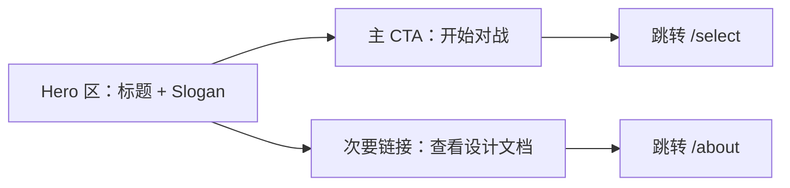
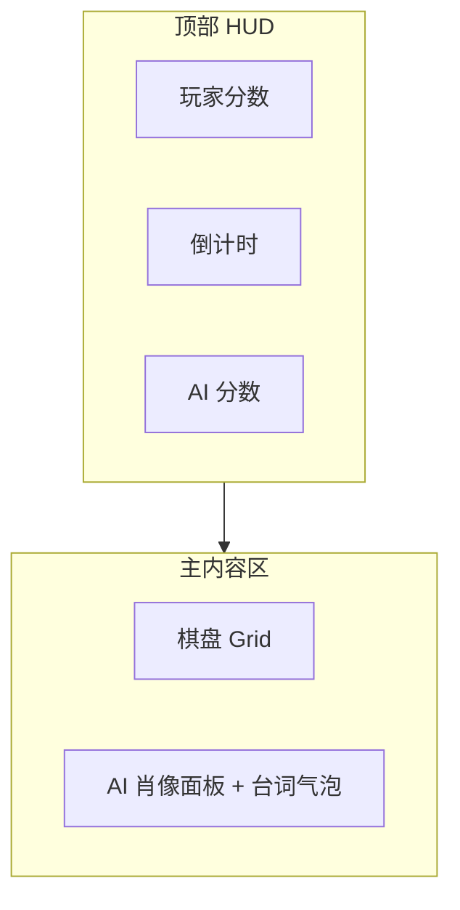

# CyberSnake UI / 交互设计文档

| 项目 | 内容 |
|------|------|
| 项目名称 | CyberSnake / 电子蛇战争 |
| 文档定位 | 与 [`DESIGN.md`](DESIGN.md) 配套的 UI/交互规格，供编码阶段直接执行 |
| 视觉风格 | 赛博像素风（Cyberpunk Pixel） |
| 技术基础 | 8bitcn/ui（像素风 React 组件库，基于 shadcn/ui + Tailwind + Radix） |
| 文档版本 | v0.1 |
| 更新日期 | 2026-08-11 |

## 目录

1. [视觉风格总览](#一视觉风格总览)
2. [技术选型说明](#二技术选型说明)
3. [首页设计](#三首页-设计)
4. [选角页设计（拳皇式）](#四选角页-select-设计拳皇式)
5. [游戏页与 HUD 设计](#五游戏页-play-与-hud-设计)
6. [结算弹层设计](#六结算弹层设计)
7. [组件清单与素材待办](#七组件清单与素材待办)

---

## 一、视觉风格总览

CyberSnake 的视觉基调是"深夜街机厅"：深色霓虹背景 + 硬边像素质感，既呼应项目名里的 *Cyber*，也呼应贪吃蛇本身的复古像素基因。三档 AI 各自再叠加一层专属主题色，让"人格差异"在视觉上先声夺人，玩家还没听到台词，先从颜色上感受到三种截然不同的气场。

### 1.1 色板

| 用途 | 颜色 | 说明 |
|------|------|------|
| 基底背景 | `#0d0d12`（近黑） | 全站主背景，营造深夜街机厅氛围 |
| 主强调色 | `#00fff2`（霓虹青） | 默认 CTA、边框发光、玩家相关信息 |
| 次强调色 | `#ff2bd6`（霓虹品红） | 警示/危险状态、蛇王相关高亮 |
| 点缀色 | `#baff29`（荧光黄绿） | 得分/正向反馈、食物元素 |
| 小贪主题色 | 浅粉 `#ff9ecf` + 浅蓝 `#8ce9ff` | 呆萌可爱基调 |
| 老谋主题色 | 冷紫 `#7b6cff` + 钢蓝 `#4a5bb0` | 冷静理性基调 |
| 蛇王主题色 | 血红 `#ff2b4a` + 暗橙 `#ff6a1f` | 阴险压迫基调 |

三档主题色不只用在选角页，也会延续到游戏页的 AI 肖像面板边框、台词气泡边框，形成贯穿始终的"人格识别色"。

### 1.2 字体

- **标题/UI 强调文字**：像素字体 `Press Start 2P`（8bitcn 默认字体），用于 Logo、页面大标题、按钮文字、HUD 数字；
- **正文文字**：系统无衬线字体（如 `Inter` / 系统默认 sans-serif），用于 `/about` 长文本、台词气泡内文字；像素字体在小字号下可读性差，长文本必须换成正常字体，避免"好看但看不清"。

### 1.3 组件质感

- 硬边像素描边（1–2px 实边框，避免柔和阴影），方形或极小圆角；
- 按钮按下有 1–2px 的位移反馈，模拟物理按键的"像素按压感"；
- 卡片/面板使用双层边框（外层深色描边 + 内层主题色细线），是像素游戏 UI 的经典处理方式。

### 1.4 动效原则

遵循 8bitcn 的 `animation-performance-retro` 规范：动画只使用 `transform` 与 `opacity`，不使用会触发浏览器重排的属性（`width`/`height`/`top`/`left`/`margin`）。具体到本项目：

- 蛇的移动采用**逐格跳跃**而非平滑插值，保留像素游戏的"格子感"，也天然贴合游戏内部按 tick 推进的逻辑；
- 台词气泡的出现/淡出用 `opacity + 轻微 translateY`，而不是渐变宽高；
- 按钮、卡片的 hover/选中效果用 `scale` 与发光边框（`box-shadow` 的颜色变化），不改变布局尺寸。

---

## 二、技术选型说明

### 2.1 为什么用 8bitcn/ui，而不是纯手写 CSS

`8bitcn/ui` 是一个开源的像素风 React 组件库（GitHub 1.8K+ star），基于 shadcn/ui、Tailwind CSS 与 Radix UI 构建，采用"复制源码到项目里"的注册表模式（而非传统 npm 包），这意味着：

- **开发效率**：56+ 基础组件（按钮、卡片、对话框、进度条等）+ 20 余个游戏向模板区块（对决区块、胜利画面、对话气泡等）开箱即用，不用从零手搓像素风 CSS；
- **无障碍性**：继承 Radix UI 的键盘导航与 ARIA 支持，不会因为"做像素风"就牺牲基本的可用性；
- **可维护性**：组件代码直接落在项目仓库里，可以按需求自由改样式，不受第三方版本升级的裹挟。

这个项目的核心卖点是"产品设计 + 可解释 AI"，UI 层面选择成熟方案、把精力留给核心亮点（AI 人格与台词系统），是合理的资源分配决策。

### 2.2 编码阶段需要的配套能力

进入编码阶段后，建议安装 8bitcn/ui 配套的 3 个 Agent Skill，作为实现规范的参考：

| Skill | 用途 |
|-------|------|
| `retro-css-architecture` | 像素字体（Press Start 2P）与 CSS 变量的组织规范 |
| `component-wrapper-architecture` | 组件封装模式——包装而非替换 shadcn 组件，保持可维护性 |
| `animation-performance-retro` | 像素动效的性能规范（对应本文档 1.4 节的动效原则） |

### 2.3 与 AI 人格设计的呼应

像素风视觉与 `DESIGN.md` 第四章的"AI 人格与台词系统"是同一叙事的两面：像素质感提供"复古街机"的怀旧外壳，会说话、有性格的 AI 提供"现代智能"的内核。两者结合起来，讲的是一个完整的故事——**"经典游戏 + 现代 AI 产品设计"**。

---

## 三、首页 `/` 设计

首页的目标很单一：3 秒内让人明白"这是什么"，并一键进入下一步。

### 3.1 布局

- **Hero 区（首屏居中）**：
  - 大标题 `CYBERSNAKE`（像素字体 + 霓虹青描边发光效果），下方小字标注中文名「电子蛇战争」；
  - Slogan：「在限时竞速中，与会思考的 AI 蛇一决高下」；
  - 主 CTA 按钮「开始对战」，8bitcn Button 组件，默认霓虹青边框，hover 时发光增强 + 轻微放大（`scale-105`）。
- **背景**：深色基底上叠加低对比度的像素网格线（模拟游戏棋盘的暗示）与极细的水平扫描线纹理，营造赛博屏幕质感；背景元素透明度低，不与前景内容争夺注意力。
- **装饰元素**：可选在页面角落放一条静态的像素蛇图形装饰（非交互），进一步暗示游戏主题。
- **页脚**：次要文字链接「查看 AI 设计文档」跳转 `/about`，字号小、颜色低调，不与主 CTA 抢视觉焦点。

### 3.2 交互细节

- 主 CTA 点击后直接跳转 `/select`，不做额外的确认步骤，保证"3 秒内开一局"的体验目标（呼应 `DESIGN.md` 第一章的用户场景）；
- 首屏不做需要等待的入场动画（如打字机效果），避免拖慢第一印象。

---

## 四、选角页 `/select` 设计（拳皇式）

这是整个网站最有"游戏感"的一页，也是玩家第一次真正接触到四位 AI 对手。

### 4.1 布局

四张人格卡并排（大屏一行四张，中屏两列，移动端纵向堆叠），参考 8bitcn 的 `Duel Block` / `Save Slots` 区块样式：

| 元素 | 说明 |
|------|------|
| 像素头像框 | 方形像素头像（放大展示），边框颜色使用该角色的主题色 |
| 称号 | 「小贪」「老谋」「蛇王」「？？？」，像素字体大号显示 |
| 一句人设台词 | 固定展示该角色的代表性台词（`AICharacter.tagline`），不随鼠标悬停或选中切换，避免频繁换词打断玩家沉浸感 |
| 难度提示条 | 用 8bit 风格的进度条表现"预期挑战强度"，而非直接写百分比胜率数字——保持游戏包装感，避免像一份数据报表 |

卡片不再展示角色简介段落，去掉的空间用于放大头像框，让"人格识别"主要靠头像与主题色完成，而非大段说明文字。

### 4.2 第四张卡片：自学习 AI「？？？」

这张卡片的所有信息都是**动态的**，来自玩家本地的成长存档（详见 `DESIGN.md` 第五章）：

| 元素 | 差异 |
|------|------|
| 名字 | 读存档里的 `name`，出厂为「？？？」，大模型进化时可能改名 |
| 台词 | 读存档里的 `tagline`，出厂为「……（它还没学会说话）」 |
| 成长徽章 | 名字下方多一行小标签：`第 N 代 · 已对战 M 局`；从未读到存档时显示「尚未觉醒」；攒够数据待进化时变为洋红色的闪烁标签 `数据已攒够 · 待进化`，进化过程中显示 `进化中…` |
| 难度提示条 | 不是预设值，而是由它自己在沙盒回测里跑出来的适应度折算而成——**这条进度条会随着玩家一局一局地喂给它数据而缓慢变长** |
| 主题色 | 数字生命感的荧光绿/青（`--mystery-green` / `--mystery-teal`） |

选中这张卡时，卡片区域下方展开「进化实验室」面板（见 4.3）。

**关于 hydration**：存档存在 `localStorage`，服务端渲染时读不到。这里用 `useSyncExternalStore` 读取，服务端快照固定返回空，由 React 在 hydrate 之后自动切换到客户端快照，避免"服务端渲染出「？？？」、客户端渲染出真名字"导致的 hydration mismatch 报错。

### 4.3 进化实验室面板（选中「？？？」时展开）

进化是这条蛇唯一的成长入口，因此它需要一块**能看到过程**的地方，而不是一个转圈的 loading。面板按运行状态切换四种形态：

| 状态 | 面板内容 | 「开始对战」按钮 |
|------|----------|------------------|
| 素材不足 | 「已积累 2/3 场败绩或平局。它赢了的对局不计入，可以继续挑战。」+ 置灰的「开始进化」 | 可用 |
| 待进化 | 「它已经攒够了败绩与平局，想复盘一次。进化完成前不能再挑战它。」+ 可点击的「开始进化」 | **禁用**，下方给出原因文案 |
| 进化中 | 五个技能的步骤列表 + 当前阶段进度条 + 实时滚动的思考日志 | **禁用** |
| 已完成 | 状态标签 + **它的自述**（第一人称一两句），技术详情（适应度变化 / 提案次数 / 结论 / 变更列表）收进默认折叠的「详情」+「它准备好了」 | 关闭播报后恢复可用 |

进化中的三层信息，从粗到细依次是：

1. **步骤列表**：`□ 待执行 / ▶ 进行中（呼吸闪烁）/ ■ 完成 / × 已跳过`，对应诊断、进化、进化测试、人格、记忆整理五个技能。任一时刻**有且只有一个**步骤处于「进行中」，且它必须正在流式输出：流水线指针前移时前序步骤一律收敛为完成，某一步的流结束后立刻收尾，不留到下一步的首个事件才熄灭。自我修正时指针会退回「诊断」重新看病，收到 `attempt` 事件即刻回退并在列表上方标出 `第 2/3 次提案`——**玩家能直接看见它在根据回测复盘返工**。分步请求由客户端编排，面板契约不变。
2. **阶段进度条**：目前只有回测阶段有确定的分母（`沙盒回测（第 4/9 局）`），其余阶段不显示假进度条，宁可留白也不编造进度。
3. **思考日志**：逐条打出模型的真实输出——诊断的根因与假设、每项策略改动的归因、回测结论与拒因、整理出的经验笔记。

**结果为什么由它自己说**：适应度、提案次数、规格 diff 是给调参看的，全摊在结果区会把"一个东西在成长"讲成一份回归报告。所以最外层只留状态标签和一句它自己的话（由人格模块产出，人格步骤被跳过时代码兜底），其余全部收进「详情」——想看数字的人点开就有，不看的人读到的是它在说话。

面板顶部展示「第 N 代 · 阶段名」。空闲时只显示一条「复盘素材」进度，页脚左侧是「开始进化」，右侧是「存档」标签 + 导出 / 导入 / 重置分段开关（标签在框外，避免被当成第四个按钮）。素材不够时主按钮保持实体、加上斜纹并压掉硬投影——看起来是锁住，而不是淡出消失。进化进行中隐藏存档入口，避免改到一份正在被改写的状态。

**为什么进化要锁住对战**：一是叙事上"先让它想明白再打"更成立；二是工程上它的基因正在被改写，此时开局用的是一份即将失效的策略。锁定状态由一个模块级的运行态 store 提供，跨页面共享——玩家中途切走再回来，进度不会丢；直接改 URL 进对战页也会被拦下并引导回选角页。

### 4.4 交互细节

- 默认无选中状态，玩家需主动点击一张卡；
- 未选中态鼠标悬停时，卡片边框轻微发光（主题色 `box-shadow`，无位移/缩放跳动感）；选中后进一步放大（`scale-105`）并叠加更强的发光，其余两张卡轻微变暗（`opacity` 降低），形成"未选中 < 悬停 < 选中"三级视觉层次；
- 卡片区域下方提供"速度"档位（慢速/标准/快速），默认选中"标准"，用于调整对战时的移动速度；速度只影响移动频率，120 秒的总时长预算不变。三个档位不是三颗独立按钮，而是拼在同一个 `.pixel-border` 容器里、靠 2px 竖线分隔的**分段开关**：三块各自带硬投影的方块并排会散成三个视觉重心，合成一条才读得出"这是一个控件的三个档位"；选中档填充霓虹青、文字反白成背景色，像一格点亮的 LED；
- 页面左上角是「← 标题页」返回入口，同一套 `.pixel-border` 语言，默认压成灰色、hover 才亮起霓虹青并让箭头左移 2px，不与居中的标题和主 CTA 抢视线；
- 选中角色后卡片下方浮现「开始对战」按钮，点击后直接跳转 `/play?ai=<角色>&speed=<所选速度对应的 tick 间隔>`，倒计时改为在 `/play` 页面内叠加展示（见 5.4 节），选角页本身不再包含倒计时或"返回重选"入口。

### 4.4 与 Roster 架构的对应关系

本页面直接读取 `DESIGN.md` 3.5 节定义的 `AICharacter` 数据结构进行渲染（头像、称号、台词池、主题色均为该结构的字段）。V2 若要新增角色，只需要在数据源中追加一条记录，本页面的布局与交互逻辑不需要任何改动。

第四张卡片是这一点的实证：它在渲染层只是"一条 `name`/`tagline`/`challengeLevel` 会变的 `AICharacter` 记录"，卡片组件本身只多接受一个可选的 `badge` 参数，没有为它写任何特判分支。

---

## 五、游戏页 `/play` 与 HUD 设计

### 5.1 整体布局

- **顶部 HUD**：左侧玩家分数、正中倒计时（120 秒递减）、右侧 AI 分数，三者视觉权重相当，不刻意突出某一方；
- **主内容区**：棋盘居中偏一侧，AI 肖像面板贴棋盘一侧边缘固定展示（对应 `DESIGN.md` 4.2 节的设计决策——只展示 AI，不给玩家配对称肖像）；
- **右上角**：像素风暂停按钮（图标化，非文字按钮，避免干扰棋盘视线），仅在开局倒计时结束后才显示；
- **进场倒计时**：从 `/select` 跳转进入本页时，棋盘/HUD/AI 肖像面板已按初始局面正常渲染，随即在最上层叠加 3 秒像素风倒计时遮罩（见 5.4 节），倒计时结束前 tick 不推进，也不会显示暂停按钮，玩家无法在此阶段返回选角页。

### 5.2 棋盘视觉

- 采用 CSS Grid 渲染 20×20 网格，网格线使用低对比度深灰色，弱化处理，避免抢夺蛇身/食物的视觉主体；
- 蛇身用实色像素方块表现，玩家蛇使用霓虹青，AI 蛇使用其当前人格的主题色（小贪粉蓝 / 老谋冷紫 / 蛇王血红），让玩家在游戏过程中也能持续通过颜色感知"在跟谁对战"；
- 食物用点缀色（荧光黄绿）的像素方块表示，并附加轻微的 `scale` 呼吸动效吸引视觉注意力。

### 5.3 AI 肖像面板与台词气泡

- 面板固定在棋盘一侧边缘（桌面端），使用该 AI 的主题色作为边框；
- 台词气泡复用/改造 8bitcn 的 `Dialogue` 组件样式，出现在肖像面板正上方或右侧，尖角指向肖像；
- 触发时机（V1.2 修订，"沉默是常态，开口是事件"）：AI **只在特殊节点才开口**，其余时间气泡保持沉默/淡出，不会有任何台词填充。完整节点清单与优先级见 `DESIGN.md` 4.3 节，简述如下：
  1. 开局第一帧播报角色签名台词（复用选角页 `tagline`）；
  2. 连续吃到 3/5/8 个豆子、被逼到死路、主动封锁玩家去路（老谋/蛇王）、持续被挡住去路超过 1.4 秒、比分差刚跨过 ±3 阈值——以上任一节点**刚发生的那一刻**播报一次，之后即使情况持续也不会重复啰嗦同一件事；
  3. 除以上节点外，AI 处于普通的追逐食物 / 常规避险 / 随机游走等日常状态时，界面上没有台词——这是刻意的沉默，用来让真正开口的那几句更有分量。
- **最短开口间隔**：`MIN_SPEECH_HOLD_MS`（约 2.4 秒）此时只是防抖用途——避免"卡住时长/比分差刚好在阈值附近来回跳"这种边界抖动被误判成两次独立事件，不再是"控制刷屏节奏"的主力手段（节点本身已经足够稀疏）。
- 动效：气泡以 `opacity 0→1` + `translateY 6px→0` 的方式浮现，停留固定时长后原路淡出；从对应节点的台词池中随机抽取且不与上一条重复。

**动态立绘（待机呼吸 + 角色专属反应动作）**：单张静态头像叠加两层只作用于 `transform`/`opacity` 的动效（符合 1.4 节的动效性能原则），让立绘"活起来"：

- **待机呼吸**：头像框（含边框）始终循环播放轻微的 `scale`/`translateY` 呼吸动效，即使没有台词切换也不会显得呆滞；
- **反应动作**：每次台词真正切换时（受上述最短展示时长闸门约束，不是每次内部状态变化都会触发），头像内层播放一次角色专属的短动效，与待机呼吸叠加而非互相替代：
  - 小贪：紧张情绪下小幅左右抖动，其余情绪下开心地向上弹跳，呆萌活泼；
  - 老谋：始终只有极小幅度的点头，动作幅度明显小于其他两位角色，强化"不动如山"的人设；
  - 蛇王：得意情绪下缓慢歪头 + 轻微放大，平静时慢速左右摇晃，透出一种不慌不忙的傲气。
- **情绪贴图**：当情绪偏离 `calm` 基线（进入 `tense` 或 `confident`）时，在头像框右上角弹出一枚按角色主题色定制的小尺寸像素图标（如汗滴、警示、星光、嘲讽符号），情绪回落到 `calm` 时贴图消失，避免常驻分散注意力。

### 5.4 开局倒计时、暂停与结束

- **开局倒计时**：进入 `/play` 后立即在页面最上层叠加全屏 3 秒数字倒计时（3-2-1-GO，像素字体放大动效），倒计时期间不提供任何返回选角页的入口，也不渲染暂停按钮，确保玩家沉浸在"即将开战"的氛围里；倒计时结束后遮罩消失，暂停按钮出现，游戏正式开始推进；
- 点击暂停按钮，游戏 tick 停止推进，弹出简单的暂停浮层（继续/返回首页两个选项）；
- 倒计时归零或任一方死亡时，直接触发第六节所述的结算弹层，不需要玩家额外操作。

---

## 六、结算弹层设计

结算以 `/play` 页内的 Modal/Overlay 形式呈现，而不是跳转到独立路由——避免"打完一局却要等页面刷新"的割裂感，也让「再来一局」的操作成本降到最低。

### 6.1 布局

参考 8bitcn 的 `Victory Screen` 风格，按胜/负/平三种结局分别定制主色调：

| 结局 | 主色调 | 图标/氛围 |
|------|--------|-----------|
| 玩家胜 | 霓虹青／荧光黄绿 | 明快、庆祝感 |
| 玩家负 | 对应 AI 主题色 | 与该 AI 人格气质一致（如输给蛇王时氛围更压迫） |
| 平局 | 中性灰紫 | 平静、不偏不倚 |

弹层内容自上而下：结果大字（像素字体，如「VICTORY」「DEFEAT」「DRAW」）→ 双方最终分数 → AI 专属彩蛋台词（对话框样式，引用 `DESIGN.md` 4.5 节内容）→ 操作按钮。

### 6.2 交互细节

- 主按钮「再来一局」：同对手、同速度原地重开一局，直接回到 3 秒倒计时（不经过选角页），把"再挑战一次"的操作成本降到最低，对应 `DESIGN.md` 2.2 节流程图里 `retry --> countdown` 的定义；
- 次按钮「返回首页」；两个按钮之间留出明显间隔，避免像素风按钮的装饰边框在堆叠时相互贴近；
- AI 彩蛋台词改为"小头像 + 对话气泡"的呈现形式（而非纯文本框），头像贴主题色像素边框，气泡带指向头像的尖角，强化"角色在说话"的扮演感。

### 6.3 成长提示（仅自学习 AI「？？？」）

对手是自学习 AI 时，结算弹层在台词气泡与操作按钮之间插入一块「成长提示」面板。**这里只做提示与引导，不触发任何大模型调用**——真正的进化在选角页发起（原因见 `DESIGN.md` 5.5）：

| 状态 | 面板内容 | 主按钮 |
|------|----------|--------|
| 素材还不够（它输了或打平） | 「它记下了这一局」+「已积累 2/3 场败绩或平局。再让它输掉或打平 1 局，就能复盘进化。」 | 「再来一局」（同对手同速度原地重开） |
| 素材还不够（它赢了） | 「这一局它赢了」+「赢了不计入复盘。已积累 1/3 场败绩或平局，可以继续挑战。」 | 「再来一局」 |
| 素材已攒够 | 「它攒够素材了」+「3 场败绩或平局已经够它复盘一次了。回选角页发起进化，才能继续挑战它。」 | **「去让它进化」**（跳转选角页） |

主按钮在攒够素材时会被替换，而不是简单加一个次要入口——否则玩家点「再来一局」就绕过了门禁，成长节奏会被打散。面板右上角同时展示它当前的成长阶段文案（由大模型命名，如「第 1 代 · 学会呼吸」）。

进化结果的完整播报（是否被否决、适应度变化、提案了几次）放在选角页的进化面板里，那里才是玩家主动看结果的地方。**"被否决"同样如实展示**：玩家看到"它这次想变得更莽，但被回测拦下来了"，反而更能理解这条蛇是在真的试错，而不是在演一段预设好的成长动画。

---

## 七、组件清单与素材待办

### 7.1 页面元素对照表

| 页面元素 | 对应组件 |
|----------|----------|
| 主 CTA | 8bitcn `Button`（改造 variant 对应主题色） |
| 面板内次要按钮 | 自定义 `PixelButton`（`.pixel-border` + `.pixel-press`），主题色走内联样式 |
| 选角卡片 | 自定义组件，`.pixel-border` 容器 + 头像框、台词区、强度条 |
| 难度提示条 / 阶段进度条 | 自定义 `PixelMeter` 分段像素条；不用 8bitcn `Progress`，它要求填充色是编译期可枚举的 Tailwind class，而这里的颜色是每个角色的主题色变量 |
| 倒计时数字 | 自定义组件，像素字体大号数字 + 缩放动效 |
| 棋盘 | 自定义 Grid 渲染组件（非 8bitcn 现成组件） |
| AI 台词气泡 | 8bitcn `Dialogue` 组件改造（换肤为三档主题色） |
| AI 动态立绘 | 自定义组件：`.portrait-idle` 待机呼吸 + 角色专属 `.portrait-react-*` 反应动效，均为纯 CSS `transform` 动画；自学习 AI 用 `.portrait-react-glitch`（横向撕裂抖动，呼应"一段正在自我改写的程序"） |
| 情绪贴图 | 自定义小图标叠加层，`.emotion-badge-pop` 弹入动效 |
| 进化实验室面板 | `PixelPanel` 外壳，嵌在选角页；技能步骤列表 + 复盘素材进度 + 页脚内存档入口（导出/导入/重置）+ 成长播报 |
| 成长提示面板 | 自定义组件，嵌在结算弹层内，按素材是否攒够切换文案与主按钮 |
| 暂停浮层 / 结算弹层 | 8bitcn `Dialog`/`Modal` 组件，结算弹层参考 `Victory Screen` 模板 |

### 7.2 素材待办清单

- 四位 AI 像素头像（小贪 / 老谋 / 蛇王 / ？？？），已用 `GenerateImage` 生成像素风头像（`public/avatars/`）；
- 四位 AI 的情绪贴图（`tense`/`confident` 各一张，共 8 张），已用 `GenerateImage` 生成并按主题色定制（`public/emotions/`）；
- 背景像素网格/扫描线纹理（可用 CSS 渐变+噪点生成，无需额外图片素材）；
- 暂停/开始等图标（可直接使用 8bitcn 内置图标风格，减少额外设计成本）。

### 7.3 本阶段不做

- 移动端触屏操作的详细交互设计（虚拟方向键/滑动手势），沿用 `DESIGN.md` V1 范围约定，留待 V2；
- AI vs AI 观战、排行榜等页面（同样是 V1 范围之外的功能，本文档不涉及）。
