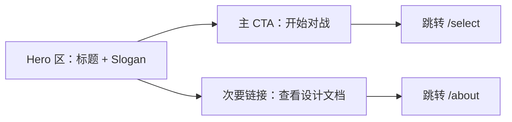
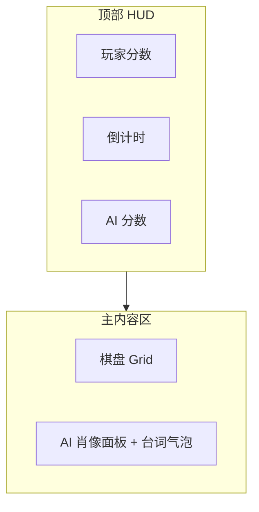

# CyberSnake UI / 交互设计文档

| 项目 | 内容 |
|------|------|
| 项目名称 | CyberSnake / 电子蛇战争 |
| 文档定位 | 与 [`DESIGN.md`](DESIGN.md) 配套的 UI/交互规格，供编码阶段直接执行 |
| 视觉风格 | 赛博像素风（Cyberpunk Pixel） |
| 技术基础 | 8bitcn/ui（像素风 React 组件库，基于 shadcn/ui + Tailwind + Radix） |
| 文档版本 | v0.1 |
| 更新日期 | 2026-08-11 |

## 目录

1. [视觉风格总览](#一视觉风格总览)
2. [技术选型说明](#二技术选型说明)
3. [首页设计](#三首页-设计)
4. [选角页设计（拳皇式）](#四选角页-select-设计拳皇式)
5. [游戏页与 HUD 设计](#五游戏页-play-与-hud-设计)
6. [结算弹层设计](#六结算弹层设计)
7. [组件清单与素材待办](#七组件清单与素材待办)

---

## 一、视觉风格总览

CyberSnake 的视觉基调是"深夜街机厅"：深色霓虹背景 + 硬边像素质感，既呼应项目名里的 *Cyber*，也呼应贪吃蛇本身的复古像素基因。三档 AI 各自再叠加一层专属主题色，让"人格差异"在视觉上先声夺人，玩家还没听到台词，先从颜色上感受到三种截然不同的气场。

### 1.1 色板

| 用途 | 颜色 | 说明 |
|------|------|------|
| 基底背景 | `#0d0d12`（近黑） | 全站主背景，营造深夜街机厅氛围 |
| 主强调色 | `#00fff2`（霓虹青） | 默认 CTA、边框发光、玩家相关信息 |
| 次强调色 | `#ff2bd6`（霓虹品红） | 警示/危险状态、蛇王相关高亮 |
| 点缀色 | `#baff29`（荧光黄绿） | 得分/正向反馈、食物元素 |
| 小贪主题色 | 浅粉 `#ff9ecf` + 浅蓝 `#8ce9ff` | 呆萌可爱基调 |
| 老谋主题色 | 冷紫 `#7b6cff` + 钢蓝 `#4a5bb0` | 冷静理性基调 |
| 蛇王主题色 | 血红 `#ff2b4a` + 暗橙 `#ff6a1f` | 阴险压迫基调 |

三档主题色不只用在选角页，也会延续到游戏页的 AI 肖像面板边框、台词气泡边框，形成贯穿始终的"人格识别色"。

### 1.2 字体

- **标题/UI 强调文字**：像素字体 `Press Start 2P`（8bitcn 默认字体），用于 Logo、页面大标题、按钮文字、HUD 数字；
- **正文文字**：系统无衬线字体（如 `Inter` / 系统默认 sans-serif），用于 `/about` 长文本、台词气泡内文字；像素字体在小字号下可读性差，长文本必须换成正常字体，避免"好看但看不清"。

### 1.3 组件质感

- 硬边像素描边（1–2px 实边框，避免柔和阴影），方形或极小圆角；
- 按钮按下有 1–2px 的位移反馈，模拟物理按键的"像素按压感"；
- 卡片/面板使用双层边框（外层深色描边 + 内层主题色细线），是像素游戏 UI 的经典处理方式。

### 1.4 动效原则

遵循 8bitcn 的 `animation-performance-retro` 规范：动画只使用 `transform` 与 `opacity`，不使用会触发浏览器重排的属性（`width`/`height`/`top`/`left`/`margin`）。具体到本项目：

- 蛇的移动采用**逐格跳跃**而非平滑插值，保留像素游戏的"格子感"，也天然贴合游戏内部按 tick 推进的逻辑；
- 台词气泡的出现/淡出用 `opacity + 轻微 translateY`，而不是渐变宽高；
- 按钮、卡片的 hover/选中效果用 `scale` 与发光边框（`box-shadow` 的颜色变化），不改变布局尺寸。

---

## 二、技术选型说明

### 2.1 为什么用 8bitcn/ui，而不是纯手写 CSS

`8bitcn/ui` 是一个开源的像素风 React 组件库（GitHub 1.8K+ star），基于 shadcn/ui、Tailwind CSS 与 Radix UI 构建，采用"复制源码到项目里"的注册表模式（而非传统 npm 包），这意味着：

- **开发效率**：56+ 基础组件（按钮、卡片、对话框、进度条等）+ 20 余个游戏向模板区块（对决区块、胜利画面、对话气泡等）开箱即用，不用从零手搓像素风 CSS；
- **无障碍性**：继承 Radix UI 的键盘导航与 ARIA 支持，不会因为"做像素风"就牺牲基本的可用性；
- **可维护性**：组件代码直接落在项目仓库里，可以按需求自由改样式，不受第三方版本升级的裹挟。

对于一个以"产品设计+可解释 AI"为核心卖点的求职作品，UI 层面选择成熟方案、把精力留给核心亮点（AI 人格与台词系统），是合理的资源分配决策。

### 2.2 编码阶段需要的配套能力

进入编码阶段后，建议安装 8bitcn/ui 配套的 3 个 Agent Skill，作为实现规范的参考：

| Skill | 用途 |
|-------|------|
| `retro-css-architecture` | 像素字体（Press Start 2P）与 CSS 变量的组织规范 |
| `component-wrapper-architecture` | 组件封装模式——包装而非替换 shadcn 组件，保持可维护性 |
| `animation-performance-retro` | 像素动效的性能规范（对应本文档 1.4 节的动效原则） |

### 2.3 与 AI 人格设计的呼应

像素风视觉与 `DESIGN.md` 第四章的"AI 人格与台词系统"是同一叙事的两面：像素质感提供"复古街机"的怀旧外壳，会说话、有性格的 AI 提供"现代智能"的内核。两者结合起来，讲的是一个完整的故事——**"经典游戏 + 现代 AI 产品设计"**，这也正是这份作品想要传达给游戏公司 AI 产品经理岗位面试官的核心信息。

---

## 三、首页 `/` 设计

首页的目标很单一：3 秒内让人明白"这是什么"，并一键进入下一步。

### 3.1 布局

- **Hero 区（首屏居中）**：
  - 大标题 `CYBERSNAKE`（像素字体 + 霓虹青描边发光效果），下方小字标注中文名「电子蛇战争」；
  - Slogan：「在限时竞速中，与会思考的 AI 蛇一决高下」；
  - 主 CTA 按钮「开始对战」，8bitcn Button 组件，默认霓虹青边框，hover 时发光增强 + 轻微放大（`scale-105`）。
- **背景**：深色基底上叠加低对比度的像素网格线（模拟游戏棋盘的暗示）与极细的水平扫描线纹理，营造赛博屏幕质感；背景元素透明度低，不与前景内容争夺注意力。
- **装饰元素**：可选在页面角落放一条静态的像素蛇图形装饰（非交互），进一步暗示游戏主题。
- **页脚**：次要文字链接「查看 AI 设计文档」跳转 `/about`，字号小、颜色低调，不与主 CTA 抢视觉焦点。

### 3.2 交互细节

- 主 CTA 点击后直接跳转 `/select`，不做额外的确认步骤，保证"3 秒内开一局"的体验目标（呼应 `DESIGN.md` 第一章的用户场景）；
- 首屏不做需要等待的入场动画（如打字机效果），避免拖慢面试官/HR 的第一印象体验。

---

## 四、选角页 `/select` 设计（拳皇式）

这是整个网站最有"游戏感"的一页，也是玩家第一次真正接触到三档 AI 人格。

### 4.1 布局

三张人格卡横向并排（移动端纵向堆叠），参考 8bitcn 的 `Duel Block` / `Save Slots` 区块样式：

| 元素 | 说明 |
|------|------|
| 像素头像框 | 方形像素头像，边框颜色使用该角色的主题色 |
| 称号 | 「小贪」「老谋」「蛇王」，像素字体大号显示 |
| 一句人设台词 | 默认展示一条代表性台词，点击/悬停头像可随机切换另一条（复用 `DESIGN.md` 附录 C 的台词池），让玩家在选角阶段就能"听见"这个角色的声音 |
| 难度提示条 | 用 8bit 风格的进度条表现"预期挑战强度"，而非直接写百分比胜率数字——保持游戏包装感，避免像一份数据报表 |

### 4.2 交互细节

- 默认无选中状态，玩家需主动点击一张卡；
- 选中后该卡边框以主题色高亮发光，其余两张卡轻微变暗（`opacity` 降低），形成焦点对比；
- 选中后卡片下方浮现「开始对战」按钮，点击后触发 3 秒像素风倒计时（全屏数字倒计时，配合像素字体的放大动画），结束后跳转 `/play`；
- 倒计时期间提供「返回重选」的取消入口，避免误触后无法反悔。

### 4.3 与 Roster 架构的对应关系

本页面直接读取 `DESIGN.md` 3.5 节定义的 `AICharacter` 数据结构进行渲染（头像、称号、台词池、主题色均为该结构的字段）。V2 若要新增角色，只需要在数据源中追加一条记录，本页面的布局与交互逻辑不需要任何改动。

---

## 五、游戏页 `/play` 与 HUD 设计

### 5.1 整体布局

- **顶部 HUD**：左侧玩家分数、正中倒计时（120 秒递减）、右侧 AI 分数，三者视觉权重相当，不刻意突出某一方；
- **主内容区**：棋盘居中偏一侧，AI 肖像面板贴棋盘一侧边缘固定展示（对应 `DESIGN.md` 4.2 节的设计决策——只展示 AI，不给玩家配对称肖像）；
- **右上角**：像素风暂停按钮（图标化，非文字按钮，避免干扰棋盘视线）。

### 5.2 棋盘视觉

- 采用 CSS Grid 渲染 20×20 网格，网格线使用低对比度深灰色，弱化处理，避免抢夺蛇身/食物的视觉主体；
- 蛇身用实色像素方块表现，玩家蛇使用霓虹青，AI 蛇使用其当前人格的主题色（小贪粉蓝 / 老谋冷紫 / 蛇王血红），让玩家在游戏过程中也能持续通过颜色感知"在跟谁对战"；
- 食物用点缀色（荧光黄绿）的像素方块表示，并附加轻微的 `scale` 呼吸动效吸引视觉注意力。

### 5.3 AI 肖像面板与台词气泡

- 面板固定在棋盘一侧边缘（桌面端），使用该 AI 的主题色作为边框；
- 台词气泡复用/改造 8bitcn 的 `Dialogue` 组件样式，出现在肖像面板正上方或右侧，尖角指向肖像；
- 触发时机：AI 内部状态切换时（`hunting`/`escaping`/`blocking`/`wandering`/`deadend`），对应 `DESIGN.md` 4.3 节的状态映射表；
- 动效：气泡以 `opacity 0→1` + `translateY 6px→0` 的方式浮现，停留 2–3 秒后原路淡出；同一状态连续触发时，从台词池中随机抽取且不与上一条重复。

### 5.4 暂停与结束

- 点击暂停按钮，游戏 tick 停止推进，弹出简单的暂停浮层（继续/返回首页两个选项）；
- 倒计时归零或任一方死亡时，直接触发第六节所述的结算弹层，不需要玩家额外操作。

---

## 六、结算弹层设计

结算以 `/play` 页内的 Modal/Overlay 形式呈现，而不是跳转到独立路由——避免"打完一局却要等页面刷新"的割裂感，也让「再来一局」的操作成本降到最低。

### 6.1 布局

参考 8bitcn 的 `Victory Screen` 风格，按胜/负/平三种结局分别定制主色调：

| 结局 | 主色调 | 图标/氛围 |
|------|--------|-----------|
| 玩家胜 | 霓虹青／荧光黄绿 | 明快、庆祝感 |
| 玩家负 | 对应 AI 主题色 | 与该 AI 人格气质一致（如输给蛇王时氛围更压迫） |
| 平局 | 中性灰紫 | 平静、不偏不倚 |

弹层内容自上而下：结果大字（像素字体，如「VICTORY」「DEFEAT」「DRAW」）→ 双方最终分数 → AI 专属彩蛋台词（对话框样式，引用 `DESIGN.md` 4.5 节内容）→ 操作按钮。

### 6.2 交互细节

- 主按钮「再来一局」：直接回到 `/select` 重新选角（而非原地重开同一难度），保留"再挑战一次人格"的仪式感，也符合 `DESIGN.md` 2.2 节的用户流程定义；
- 次按钮「返回首页」；
- 底部小字链接「查看 AI 设计说明」跳转 `/about`，方便面试官顺着 Demo 直接看到设计文档。

---

## 七、组件清单与素材待办

### 7.1 页面元素对照表

| 页面元素 | 对应组件 |
|----------|----------|
| 主 CTA / 次要按钮 | 8bitcn `Button`（改造 variant 对应主题色） |
| 选角卡片 | 8bitcn `Card` + 自定义头像框、台词区、进度条 |
| 难度提示条 | 8bitcn 进度条组件（Health/XP Bar 样式复用） |
| 倒计时数字 | 自定义组件，像素字体大号数字 + 缩放动效 |
| 棋盘 | 自定义 Grid 渲染组件（非 8bitcn 现成组件） |
| AI 台词气泡 | 8bitcn `Dialogue` 组件改造（换肤为三档主题色） |
| 暂停浮层 / 结算弹层 | 8bitcn `Dialog`/`Modal` 组件，结算弹层参考 `Victory Screen` 模板 |

### 7.2 素材待办清单

- 三档 AI 像素头像（小贪 / 老谋 / 蛇王），后续可用 `GenerateImage` 生成像素风头像，或从开源像素素材库挑选后本地化调整；
- 背景像素网格/扫描线纹理（可用 CSS 渐变+噪点生成，无需额外图片素材）；
- 暂停/开始等图标（可直接使用 8bitcn 内置图标风格，减少额外设计成本）。

### 7.3 本阶段不做

- 移动端触屏操作的详细交互设计（虚拟方向键/滑动手势），沿用 `DESIGN.md` V1 范围约定，留待 V2；
- AI vs AI 观战、排行榜等页面（同样是 V1 范围之外的功能，本文档不涉及）。
